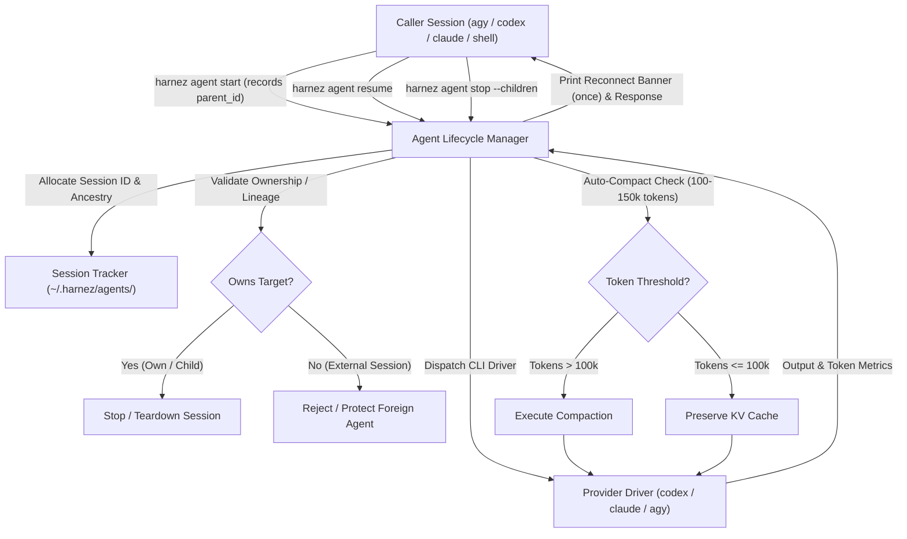

# Harnez Agent Architecture — Unified Cross-Harness Subagent Dispatch & Lifecycle

## 1. Executive Summary & Vision

Modern AI coding environments (`Antigravity/AGY`, `OpenAI Codex`, `Claude Code`, `Local/lmcoder`) provide heterogeneous, incompatible mechanisms for managing subagents:
- `agy` provides IDE-level subagent primitives (`invoke_subagent`, `manage_subagents`) with reactive wakeups.
- `codex` provides CLI session resumption (`codex -a never -s danger-full-access exec` and `exec resume <session_id>`).
- `claude` provides non-interactive prompt runs (`claude -p`).
- Local models execute in Podman containers via `lmcoder agent`.

Without a unified layer, orchestrators cannot reliably invoke low-cost models across harness boundaries, measure real token velocity per milestone, or maintain predictable auto-compaction and cache-affinity policies.

`harnez agent` provides a **single, universal CLI command surface** and **cross-harness subagent lifecycle manager** that:
1. Dispatches and resumes developer subagents across all providers (`codex`, `claude`, `agy`, `local`). Known limit: a `claude:*` session started from inside Claude Code can't be resumed yet, because the child doesn't save its transcript (issue 498). Use one fresh session per milestone, with the ticket as context.
2. Provides explicit, first-class reconnectability with a concise **Reconnect Banner** emitted on agent start.
3. Enforces **session isolation and ancestry-scoped process hygiene**: agents only manage and terminate their own child agents; external sessions running concurrently in other tools/windows are strictly protected from cross-session interference.
4. Enforces **automatic context compaction** (threshold-based at 100–150k tokens or milestone boundaries) and detects idle KV-cache expiration.
5. Integrates seamlessly into all **Sprint Skills** (`sprint`, `lean-sprint`, `reverse-sprint`).
6. Supports an **Opt-In/Out Feature Switch** (`subagent_mode: harnez|native`) allowing native tool interception/replacement and side-by-side A/B effectiveness/token-usage comparisons.

---

## 2. Command Surface & Verb Specifications

```
harnez agent <verb> [flags] [args...]
```



### 2.1 Command forms and handles

The root command accepts the compact prompt form:

```text
harnez agent -p "summarise the open tickets"
harnez agent --name docs -d ~/projects/x "update the changelog"
harnez agent -c -p "continue"
harnez agent --name w -p "/compact"
```

The explicit verbs are:

```text
harnez agent start --name w --model luna -f task.md -- "extra instructions"
harnez agent start --detach --name w --model luna -p "background task"
harnez agent wait w --timeout 5m
harnez agent resume --name w "next step"
harnez agent chat
harnez agent chat attach --name w
harnez agent list [--children|--all-sessions]
harnez agent status --name w
harnez agent compact --name w
harnez agent stop --name w
harnez agent delete --name w
harnez agent models [--names]
```

`--name` selects a session, `--model` selects a provider/model/tier, and `-d`
selects the working-directory or attribution scope. A missing model uses the
specification in `spec/agent.yaml`; bare aliases such as `luna` are accepted.
Root prompt forms also provide `-p/--prompt`, repeatable `-f/--file`, `-c/--continue`,
`--stream full|stats`, `--plan yes|no`, and `--json`. `--` sends following text
literally. There are no legacy provider-first or positional-session forms.

### 2.11 MCP server for Codex

`harnez mcp` serves the agent lifecycle tools over newline-delimited JSON-RPC
stdio. Register it with Codex CLI once per user account:

```sh
codex mcp add harnez -- "$(command -v harnez)" mcp
codex mcp list
```

Codex starts the configured process and discovers `harnez_spawn_agent`,
`harnez_list_agents`, `harnez_agent_status`, `harnez_resume_agent`, and
`harnez_stop_agent`, and `harnez_wait_agent`. These tools invoke the matching
`harnez agent` commands, so the caller's Harnez role and lineage restrictions
still apply. The server uses stdout only for MCP protocol messages; keep
diagnostic output on stderr.

`harnez_spawn_agent` accepts `prompt` and optional `model`, `role`, `dir`,
`name`, and `async` arguments. `async` defaults to `false`, preserving the
original behavior of waiting for and returning the result. With `async: true`,
the call starts a detached worker and promptly returns its session record with
`status: "running"`, session ID, worker PID, and stdout/stderr log paths.
`harnez_wait_agent` takes `session_id` (ID or name) and optional integer
`timeout_seconds`. It waits for a terminal state and returns the session record
including the captured response and messages. On timeout it returns the still
running session record; callers may wait again. If the worker exits without
recording a terminal state, wait marks the session failed with an error.
Completed sessions stay in the registry until an authorized caller deletes
them with `harnez agent delete --name <session>`.

For a noninteractive Codex integration check that must call an MCP tool, use
Codex's `--approve-for-me` option; the `never` approval policy rejects MCP tool
calls that require approval. A successful spawn returns the Harnez session and
agent response as structured tool output.

### 2.2 Prompt assembly

Prompt parts are joined with one blank line, in this order: prompt files in
flag order (`-f -` reads stdin), `-p` text, positional words, and the text after
`--`. The protocol preamble is added only when sending the prompt. A stored
start prompt records file paths and byte sizes rather than file contents.

### 2.3 Session selection and attribution

A named root session is an upsert: an existing name resumes and an unknown name
starts. `-c` resumes the most recent attributable session in `-d`, or starts a
new session when none exists. Bare `resume` requires exactly one attributable
session; zero and multiple candidates are errors. Attribution requires a
resumable, manageable session in the canonical directory and caller lineage.
Destructive verbs never accept `-c`; they require `--name` or their existing
explicit scope options. Output reports `resolved=name`, `resolved=dir`,
`resolved=continue`, or `resolved=new` in the session-info line.

New sessions receive generated memorable names, avoiding names and IDs already
in the store. The list `RESUME` column reports whether a session is resumable;
resume failures are retained as last-error diagnostics.

### 2.4 Interactive sessions

`chat` launches an interactive session, and `chat attach --name` attaches to
one with a provider session ID. Interactive sessions may receive prompt,
compact, and stop control messages through their control socket.

### 2.5 Lifecycle verbs

`list`, `status`, `compact`, `stop`, and `delete` operate on sessions selected
by `--name` and the configured directory/lineage rules. `status` can report a
repository-wide view when no name is supplied. `stop --children` and
`stop --all` retain their explicit bulk behavior; delete refuses active
interactive sessions until they are stopped.

### 2.6 Slash commands

A single-line root prompt beginning with `/` is intercepted unless it came from
after `--`. `/compact`, `/stop`, and `/status` act on the named session, the
most recent `-c` session, or the unique attributable session in `-d`.
Unknown commands fail with an instruction to send them literally using `--`.

### 2.7 Model and session records

Model aliases resolve through the configured model specification and the
provider driver. Session records retain provider/model/tier, working directory,
parent lineage, status, token counters, cached tokens, and last-error data.
Provider/model selection on resume must match the existing session.

### 2.8 Concurrency and lineage isolation

Every session records its parent session, caller PID, harness type, and working
directory. Operations only manage sessions in the caller's lineage; foreign
sessions are rejected or ignored according to the operation's scope.

### 2.9 Output protocol

Streaming output is written to stdout using labeled blocks. A turn begins with
`[session info ...]` and `[wait]`. Message events are labeled
`[confirmation]`, `[plan]`, `[message]`, or `[compaction ack]`. Both stream
modes emit `[heartbeat]` at 30s, 1m, 2m, 4m, 6m, 10m, then every 5m. In
`--stream stats` mode only the confirmation and plan are shown live and the
final message is printed as `[reply]` (a final message that was already shown
live is not repeated). A plan turn ends with `[gate]`; malformed plans may
produce `[warning]`, and protocol violations produce `[violation]`. Every turn
ends with `[done]`, including new-versus-cached token counts.

The provider prompt starts with the `CONFIRM:`/`PLAN:` protocol preamble. The
confirmation watchdog waits 10 seconds for the first confirmation and reports
violations without changing the provider prompt. While streaming, stderr stays
empty and every block goes to stdout; failures are returned as the command
error, without a usage dump. Without streaming (`--json`, providers that do
not stream) a `[session timeline]` is written to stderr instead.

### 2.10 Roles and delegation depth

Every session has a role: `orchestrator`, `developer`, `reviewer` or `advisor` (`--role`,
default `developer`). Roles, the roles each may start (`spawns`) and their rules text are
defined in `spec/agent.yaml`. The role is stored on the session, exported to the provider
process as `HARNEZ_AGENT_ROLE` together with `HARNEZ_SESSION_ID` (the session name, the
parent id of anything the worker starts), and its rules are added to every turn. A leaf
role (empty `spawns`) is refused by `start`, `resume`, `stop`, `delete`, `compact`, `chat`,
`enable`/`disable`, root prompts and slash commands; `list`, `status` and `models` stay
available. An orchestrator may start developer, reviewer and advisor sessions, never
another orchestrator. A caller without a role (a human or an untracked host) is
unrestricted. Tests must not depend on these variables (`TestMain` clears them). Operating
guide and pitfalls: `docs/OrchestratedAgentFlow.md`.

## 3. Model Shorthand & Vendor Mapping

`spec/agent.yaml` is the single source for aliases, provider model names, default tiers and
per-model guidance (`roles`, `use`, `use_med`). `harnez agent models` prints them as a
table (SPEC, MODEL, EFFORT, ROLES, USE); `--names` prints bare specs for scripts and
completion. Each effort-capable codex/agy model also lists a `:med` variant. Evidence behind
the guidance: `docs/Models.md`.

The guidance is loaded separately from `subagent.Model` (`ModelGuide`) so session records
never carry it and `Model` stays comparable.

How a spec reaches the provider CLI (batch drivers):

| Provider | Invocation | Tier handling |
|---|---|---|
| codex | `codex exec --json --dangerously-bypass-approvals-and-sandbox -m <name> -c model_reasoning_effort=<tier>` | `low`/`med`/`high` → reasoning effort |
| claude | `claude -p --dangerously-skip-permissions --model <name> [--effort <tier>] --output-format json` | explicit `low`/`med`/`high` tier passed as `low`/`medium`/`high`; omitted when no tier is set |
| agy | `agy --model <name> --effort <tier>` | effort omitted for `effort: false` models (`agy:sonnet`, `agy:opus`) |

---

## 4. Auto-Compaction & Cache-Affinity Management

### 4.1 Auto-Compaction Trigger Rules
1. **Cumulative Token Threshold**: When a session reaches 100,000–150,000 cumulative tokens, `harnez agent` automatically triggers context compaction at the milestone boundary.
2. **Turn-Boundary Compaction**: The agent persists its decisions and code pointers to disk/ticket, then compacts its history before accepting the next milestone prompt.
3. **Manual Override**: Callers can disable auto-compaction per run using `--no-compact`.

### 4.2 Idle KV-Cache Freshness Detection
- LLM providers typically retain KV prefix caches for 5 to 10 minutes of inactivity.
- If a subagent has been idle beyond this threshold:
  - `harnez agent status` reports `CACHED: EXPIRED`.
  - On the next `harnez agent resume`, `harnez agent` detects that cache re-use savings are 0% and logs the re-ingestion cost.
  - If cumulative tokens exceed 50k and cache is expired, `harnez agent` can advise or auto-spawn a fresh subagent to avoid paying the full re-ingestion cost on stale history.

---

## 5. Native Subagent Replacement & Opt-In Feature Switch

To allow side-by-side benchmarking and empirical evaluation between native subagent tools and `harnez agent`, a global configuration switch is provided:

### 5.1 Configuration Switch (`config.yaml`)

```yaml
# Subagent dispatch strategy:
# - "harnez": Universal harnez agent dispatch with token metrics, auto-compaction, and cross-harness support
# - "native": Standard harness-native subagent tools (invoke_subagent in agy, native codex/claude subagents)
subagent_mode: harnez

# Global CLI flag overrides:
# harnez apply --enable-harnez-agent
# harnez apply --disable-harnez-agent
```

### 5.2 Native Subagent Interception Behavior
When `subagent_mode: harnez` is enabled:
1. **Pre-Tool Interception in AGY & Codex Hooks**:
   - When a model calls native `invoke_subagent` or `spawn_agent`, the harness hook intercepts the call before execution.
   - On the first invocation, it returns an explicit redirection instruction:
     ```
     [HARNEZ SUBAGENT INTERCEPTION]:
     Native 'invoke_subagent' is replaced by 'harnez agent'.
     Please dispatch subagents using:
       harnez agent start --name <name> --model <model> "<prompt>"
     To resume an existing agent:
       harnez agent resume --name <session_id> "<prompt>"
     Refer to docs/HarnezAgentArchitecture.md for complete details.
     ```
2. **Seamless Tool Replacement (Phase 2)**:
   - Registers a customized `harnez_agent` tool in the harness schema that directly wraps `harnez agent start/resume/list/stop`.

### 5.3 A/B Comparative Telemetry
Both execution modes log telemetry to `~/.harnez/tool_catalog.sqlite`:
- Turn execution duration (ms)
- Input, output, and cached token consumption
- Total financial cost
- Milestone completion success rate
- Developers can run `harnez assess --subagents` or `harnez stats` to compare:
  - Native vs `harnez agent` token overhead.
  - Cache hit ratios and turn latency.

---

## 6. Sprint Skills Integration

Tickets are the primary durable communication channel between the host and
agents. Prompts should point to the ticket and carry only the short, immediate
follow-up needed to continue the work. The synchronous `start` and `resume`
commands make the reply available directly to the host; use the host's visible
background-job facility when parallel dispatch is appropriate.

All sprint skills are updated to natively orchestrate via `harnez agent`:

1. **`/lean-sprint`**:
   - Host dispatches the worker: `harnez agent start --model luna -d <repo> "<milestone_prompt>"`.
   - Host inspects diff and resumes: `harnez agent resume --name <session_id> "Pre-work & Milestone 2..."`.
   - Host terminates upon completion: `harnez agent delete --name <session_id>`.

2. **`/reverse-sprint`**:
   - Dev lead starts directly in low tier (`luna:low`).
   - Dev lead calls reviewer: `harnez agent start --model sol "Review diff HEAD~1"`.
   - Dev lead calls advisor only when stuck: `harnez agent start --model astra "Inspect lines 40-60 in handler.go"`.
   - Auto-compacts every 100–150k tokens via `harnez agent compact`.

3. **`/sprint`**:
   - Phase 1 Advisor: `harnez agent start --model agy:flash:med --name sprint-advisor "<audit_task>"`.
   - Phase 2 Devs: `harnez agent start --model luna --name dev-cli "<dev_task>"`.
   - Phase 3 Reviewer: `harnez agent start --model sol "<review_task>"`.
   - Phase 4 Hygiene: `harnez agent stop --children` (terminates only subagents spawned by this session, preserving foreign sessions).
