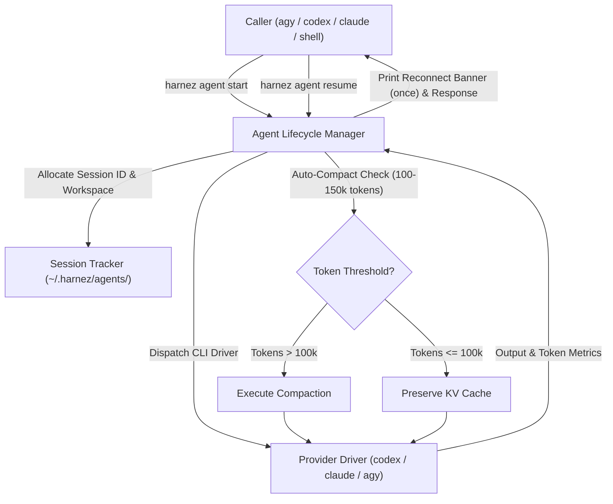

# Harnez Agent Architecture — Unified Cross-Harness Subagent Dispatch & Lifecycle

## 1. Executive Summary & Vision

Modern AI coding environments (`Antigravity/AGY`, `OpenAI Codex`, `Claude Code`, `Local/lmcoder`) provide heterogeneous, incompatible mechanisms for managing subagents:
- `agy` provides IDE-level subagent primitives (`invoke_subagent`, `manage_subagents`) with reactive wakeups.
- `codex` provides CLI session resumption (`codex -a never -s danger-full-access exec` and `exec resume <session_id>`).
- `claude` provides non-interactive prompt runs (`claude -p`).
- Local models execute in Podman containers via `lmcoder agent`.

Without a unified layer, orchestrators cannot reliably invoke low-cost models across harness boundaries, measure real token velocity per milestone, or maintain predictable auto-compaction and cache-affinity policies.

`harnez agent` provides a **single, universal CLI command surface** and **cross-harness subagent lifecycle manager** that:
1. Dispatches and resumes developer subagents across all providers (`codex`, `claude`, `agy`, `local`).
2. Provides explicit, first-class reconnectability with a concise **Reconnect Banner** emitted on agent start.
3. Enforces **automatic context compaction** (threshold-based at 100–150k tokens or milestone boundaries) and detects idle KV-cache expiration.
4. Integrates seamlessly into all **Sprint Skills** (`sprint`, `lean-sprint`, `reverse-sprint`).
5. Supports an **Opt-In/Out Feature Switch** (`subagent_mode: harnez|native`) allowing native tool interception/replacement and side-by-side A/B effectiveness/token-usage comparisons.

---

## 2. Command Surface & Verb Specifications

```
harnez agent <verb> [flags] [args...]
```



### 2.1 `harnez agent start` (Spawn a Subagent)
Starts a new agent session on the specified target provider/model.

```bash
harnez agent start <provider>:<model>[:<tier>] [-d <working_dir>] [--name <session_name>] "<task_prompt>"
```

- **Examples**:
  ```bash
  harnez agent start codex:luna:low "Implement reproducing test for issue 417"
  harnez agent start codex:sol:low -d /path/to/repo --name dev-linter "Fix lint warnings"
  harnez agent start claude:sonnet:low "Review commit diff"
  harnez agent start agy:flash:med "Explore AST parser structure"
  ```
- **Lifecycle Reconnect Banner (Emitted ONLY ONCE on start)**:
  ```
  ┌────────────────────────────────────────────────────────────────────────┐
  │ Harnez Agent Started: agent-codex-luna-01a0b369                       │
  │ Model: gpt-5.6-luna (effort: low) | PID: 48192 | WorkingDir: /home/uwe │
  │                                                                        │
  │ Reconnect / Resume: harnez agent resume agent-codex-luna-01a0b369 "..."│
  │ Check Status:       harnez agent status agent-codex-luna-01a0b369      │
  │ Stop Session:       harnez agent stop agent-codex-luna-01a0b369        │
  │ Delete / Teardown:  harnez agent delete agent-codex-luna-01a0b369      │
  └────────────────────────────────────────────────────────────────────────┘
  ```
- **Structured JSON Output (`--json`)**:
  ```json
  {
    "session_id": "01a0b369-f462-7741-8ced-8d97fd2f8bac",
    "name": "agent-codex-luna-01a0b369",
    "provider": "codex",
    "model": "gpt-5.6-luna",
    "tier": "low",
    "status": "completed",
    "tokens_turn": 4210,
    "tokens_cumulative": 4210,
    "cached_tokens": 0,
    "duration_ms": 6120,
    "reconnect_cmd": "harnez agent resume 01a0b369-f462-7741-8ced-8d97fd2f8bac \"<prompt>\"",
    "response": "PASS: Reproduction test created in internal/subagent/driver_test.go"
  }
  ```

### 2.2 `harnez agent resume` (Reconnect to Session)
Resumes an existing session with full conversational memory and KV-cache continuity.

```bash
harnez agent resume <session_id|name> "<next_prompt>"
```

- If cumulative token usage exceeds the compaction threshold (100–150k tokens), `harnez agent` automatically executes context compaction before executing the turn.
- Returns turn response and updated cumulative token telemetry.

### 2.3 `harnez agent list`
Lists active, idle, and parked subagent sessions.

```bash
harnez agent list [--all] [--json]
```

Output:
```
ID                                    NAME              PROVIDER  MODEL         STATUS     TOKENS   IDLE     CACHED
01a0b369-f462-7741-8ced-8d97fd2f8bac  dev-linter        codex     gpt-5.6-luna  idle       18.4k    2m10s    YES (94%)
01a0b370-6966-7640-8eae-3bfb0d7b14e2  reviewer-sol      codex     gpt-5.6-sol   parked     112.1k   45m00s   EXPIRED
```

### 2.4 `harnez agent status`
Provides detailed inspection of a session's health, token growth trajectory, and cache freshness.

```bash
harnez agent status <session_id|name> [--json]
```

### 2.5 `harnez agent compact`
Explicitly invokes context compaction for a session.

```bash
harnez agent compact <session_id|name>
```

### 2.6 `harnez agent stop` & `delete` (alias `rm`)
- `harnez agent stop <session_id|name>`: Gracefully stops running tasks and parks the session.
- `harnez agent delete <session_id|name>`: Terminates the process, clears ephemeral working files, and purges state.

---

## 3. Model Shorthand & Vendor Mapping

The model resolution engine standardizes aliases across providers:

| Alias Shorthand | Target Provider | Fully-Qualified CLI Invocations & Flags | Default Use Case |
|---|---|---|---|
| `codex:luna:low` / `codex:luna` | OpenAI Codex | `codex -a never -s danger-full-access exec -m gpt-5.6-luna --effort low` | Ultra-cheap coder / dev lead |
| `codex:luna:med` | OpenAI Codex | `codex -a never -s danger-full-access exec -m gpt-5.6-luna --effort medium` | Standard development |
| `codex:sol:low` / `codex:sol` | OpenAI Codex | `codex -a never -s danger-full-access exec -m gpt-5.6-sol --effort low` | Fast code review / linting |
| `codex:astra:low` / `codex:astra` | OpenAI Codex | `codex -a never -s danger-full-access exec -m gpt-5.6-astra --effort low` | Frontier advisor (stuck only) |
| `claude:haiku:low` / `claude:haiku` | Claude Code | `claude -p --model claude-3-5-haiku-20241022` | Lightweight coder |
| `claude:sonnet:low` / `claude:sonnet` | Claude Code | `claude -p --model claude-3-7-sonnet-20250219 --effort low` | Mid-tier reviewer |
| `claude:opus:low` / `claude:opus` | Claude Code | `claude -p --model claude-3-opus-20240229` | Deep advisor |
| `agy:flash:low` / `agy:flash` | Gemini / AGY | `agy -m gemini-3.7-flash --effort low` | Fast coder / research |
| `agy:flash:med` | Gemini / AGY | `agy -m gemini-3.8-flash --effort medium` | Mid-tier advisor |
| `local:lmcoder` | Local GPU / Podman | `lmcoder agent exec --model qwen38-q5 --host x600` | Offline sandbox coder |

---

## 4. Auto-Compaction & Cache-Affinity Management

### 4.1 Auto-Compaction Trigger Rules
1. **Cumulative Token Threshold**: When a session reaches 100,000–150,000 cumulative tokens, `harnez agent` automatically triggers context compaction at the milestone boundary.
2. **Turn-Boundary Compaction**: The agent persists its decisions and code pointers to disk/ticket, then compacts its history before accepting the next milestone prompt.
3. **Manual Override**: Callers can disable auto-compaction per run using `--no-compact`.

### 4.2 Idle KV-Cache Freshness Detection
- LLM providers typically retain KV prefix caches for 5 to 10 minutes of inactivity.
- If a subagent has been idle beyond this threshold:
  - `harnez agent status` reports `CACHED: EXPIRED`.
  - On the next `harnez agent resume`, `harnez agent` detects that cache re-use savings are 0% and logs the re-ingestion cost.
  - If cumulative tokens exceed 50k and cache is expired, `harnez agent` can advise or auto-spawn a fresh subagent to avoid paying the full re-ingestion cost on stale history.

---

## 5. Native Subagent Replacement & Opt-In Feature Switch

To allow side-by-side benchmarking and empirical evaluation between native subagent tools and `harnez agent`, a global configuration switch is provided:

### 5.1 Configuration Switch (`config.yaml`)

```yaml
# Subagent dispatch strategy:
# - "harnez": Universal harnez agent dispatch with token metrics, auto-compaction, and cross-harness support
# - "native": Standard harness-native subagent tools (invoke_subagent in agy, native codex/claude subagents)
subagent_mode: harnez

# Global CLI flag overrides:
# harnez apply --enable-harnez-agent
# harnez apply --disable-harnez-agent
```

### 5.2 Native Subagent Interception Behavior
When `subagent_mode: harnez` is enabled:
1. **Pre-Tool Interception in AGY & Codex Hooks**:
   - When a model calls native `invoke_subagent` or `spawn_agent`, the harness hook intercepts the call before execution.
   - On the first invocation, it returns an explicit redirection instruction:
     ```
     [HARNEZ SUBAGENT INTERCEPTION]:
     Native 'invoke_subagent' is replaced by 'harnez agent'.
     Please dispatch subagents using:
       harnez agent start <tool>:<model> "<prompt>"
     To resume an existing agent:
       harnez agent resume <session_id> "<prompt>"
     Refer to docs/HarnezAgentArchitecture.md for complete details.
     ```
2. **Seamless Tool Replacement (Phase 2)**:
   - Registers a customized `harnez_agent` tool in the harness schema that directly wraps `harnez agent start/resume/list/stop`.

### 5.3 A/B Comparative Telemetry
Both execution modes log telemetry to `~/.harnez/tool_catalog.sqlite`:
- Turn execution duration (ms)
- Input, output, and cached token consumption
- Total financial cost
- Milestone completion success rate
- Developers can run `harnez assess --subagents` or `harnez stats` to compare:
  - Native vs `harnez agent` token overhead.
  - Cache hit ratios and turn latency.

---

## 6. Sprint Skills Integration

All sprint skills are updated to natively orchestrate via `harnez agent`:

1. **`/lean-sprint`**:
   - Host dispatches the worker: `harnez agent start codex:luna:low -d <repo> "<milestone_prompt>"`.
   - Host inspects diff and resumes: `harnez agent resume <session_id> "Pre-work & Milestone 2..."`.
   - Host terminates upon completion: `harnez agent delete <session_id>`.

2. **`/reverse-sprint`**:
   - Dev lead starts directly in low tier (`luna:low`).
   - Dev lead calls reviewer: `harnez agent start codex:sol:low "Review diff HEAD~1"`.
   - Dev lead calls advisor only when stuck: `harnez agent start codex:astra:low "Inspect lines 40-60 in handler.go"`.
   - Auto-compacts every 100–150k tokens via `harnez agent compact`.

3. **`/sprint`**:
   - Phase 1 Advisor: `harnez agent start agy:flash:med --name sprint-advisor "<audit_task>"`.
   - Phase 2 Devs: `harnez agent start codex:luna:low --name dev-cli "<dev_task>"`.
   - Phase 3 Reviewer: `harnez agent start codex:sol:low "<review_task>"`.
   - Phase 4 Hygiene: `harnez agent stop --all`.
