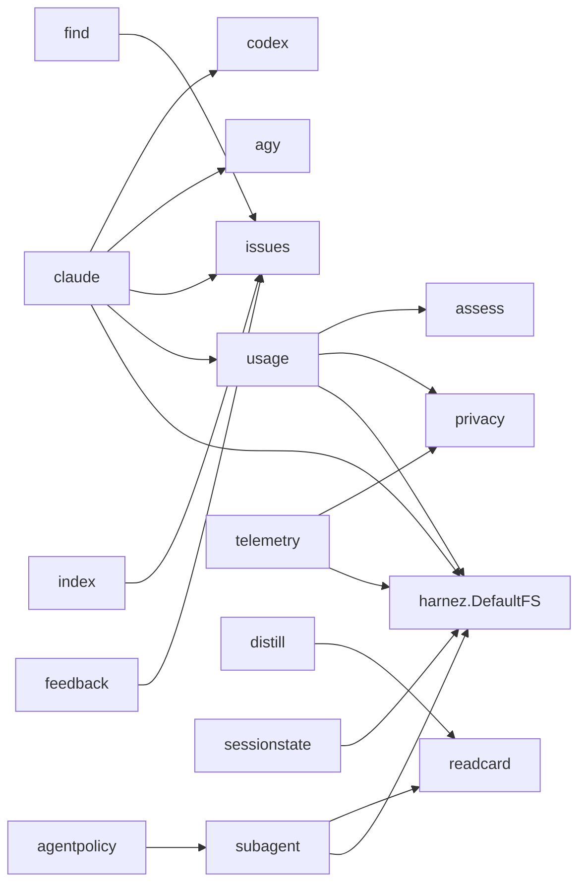
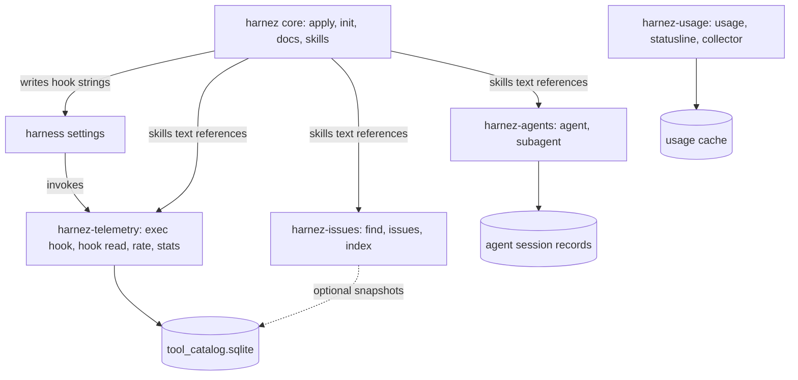

# Harnez Components — Coupling Analysis & Separation Boundaries

Findings report for issue 489. Scope: can the single `harnez` binary be split into
composable tools (docs/skills core, agents, init, telemetry), and what would that cost?
No code was changed; all numbers come from `go list` over the module at `def6d1a`.

## 1. Current Architecture

One Go module (`ubunatic.com/harnez`), one binary (~23 MB), one version (`version.go`),
one embedded asset tree (`embed.go`: `config.yaml`, `docs/{commands,lang,other,practices,templates}`,
`systemd/`, `spec/`). `cmd/harnez` (70 files) wires every subsystem; `internal/` holds
29 packages.

The `internal/` package graph is already shallow and almost acyclic by subsystem.
All cross-subsystem coupling is concentrated in three places:

1. `cmd/harnez` — every command file lives in one `main` package.
2. The root package `harnez.DefaultFS` — the embedded spec/docs tree.
3. Runtime contracts — hook command strings, the shared SQLite store, `config.yaml`.

### 1.1 Subsystems as they exist today

| Subsystem | Packages | Commands | External deps |
|---|---|---|---|
| **Docs/skills core** (apply) | `claude`, `codex`, `agy`, `markdown`, `jsonc`, `fsutil`, `mode` | `apply`, `diff`, `clean`, `status`, `revert`, `docs`, `docs cards`, `mode`, `scan-docs` | `toml` (codex) |
| **Init** | `claude` (`init.go`, `maketargets.go`, `gowork.go`), `assess` | `init` | — |
| **Agents** | `subagent`, `agentpolicy`, `sessionstate`, `compactcheck` | `agent *`, `subagent`, `compact-check` | `creack/pty`, `x/term` |
| **Telemetry** (hooks + store) | `telemetry`, `privacy`, `resolve`, `distill`, `quota1` | `exec hook`, `hook read`, `codex-hook`, `codex-telemetry`, `rate`, `log`, `stats`, `export`, `distill` | `modernc.org/sqlite` |
| **Usage/quota monitor** | `usage`, `rograph`, `uix`, `statusline`, `assess` | `usage`, `load-stream`, `history`, `timeline`, `fetch`, `record`, `agent-collector`, `statusline`, `assess`, `dochistory` | `voxi`, `go-runewidth` |
| **Issue tracker** | `issues`, `find`, `index`, `feedback` | `issues *`, `find`, `index`, `feedback` | — |
| **Shared libraries** | `readcard`, `fsutil`, `markdown` | `read` | — |
| **Standalone tools** | `release`, `bench`, `lint`, `gitstatus` | `release`, `bench`, `lint`, `repo-status` | sqlite (bench) |

The ticket's four-way split misses two subsystems that are as large as the ones it names:
the usage/quota monitor (`internal/usage`, 55 files, the largest package) and the issue
tracker. Any separation plan has to place them.

## 2. Coupling Analysis

### 2.1 Package-level imports (`internal/` only)

Cross-subsystem edges, with the exact symbols used:

| Edge | Symbols | Nature |
|---|---|---|
| `claude → issues` | `issues.Lint` | apply/status lints the tracker — incidental |
| `claude → usage` | `usage.LoadLocalConfig` | reads local usage config — incidental |
| `claude → codex`, `claude → agy` | `Apply`, `Remove`, `Status`, `Summary`, debloat | per-harness installers — intrinsic to apply |
| `subagent → readcard` | provider detection, `RenderBundleCard`, `CheckCard` | shared library, not a subsystem dependency |
| `telemetry`, `usage`, `subagent`, `sessionstate`, `claude → ROOT` | `DefaultFS` (`spec/*.yaml`, `config.yaml`) | shared embedded assets |

There is **no** package-level edge between agents and telemetry, agents and docs, or
telemetry and docs. The agent subsystem does not record its token costs into the
telemetry store (`subagent.Session` keeps its own counters).

### 2.2 Command-level coupling (`cmd/harnez`)

The real coupling is in command files that compose several subsystems:

| Command file | Composes | Why it matters |
|---|---|---|
| `exec.go` (`exec hook`) | telemetry + distill + quota1 + `claude.OpenConfig` | the one PreToolUse/Bash hook; distill rewrite composed inside it (issue 116/118, `docs/HookRewritePattern.md`) — cannot be split into two hooks |
| `hook.go` (`hook read`) | readcard reading discipline + telemetry | same single-hook constraint for Read/View |
| `stats.go` | telemetry + `claude.Config` | `--overhead` sizes installed instruction text |
| `find.go`, `index.go` | issue tracker + telemetry | write issue-status snapshots into the store |
| `main.go` | apply + usage + telemetry + sessionstate + agy/codex | root command and ~15 subcommands in one file |
| `init.go` | `claude` + `assess` | init reuses the apply package's config and doc machinery |
| `agent.go` | subagent + agentpolicy + privacy | self-contained |

### 2.3 Runtime contracts

These do not show up in `go list` but bind the subsystems harder than imports do:

1. **Hook command strings.** `apply` writes `harnez exec hook`, `harnez hook read`,
   `harnez codex-hook`, and the agy wildcard hook into harness settings. Apply (docs core)
   thus installs telemetry entry points by binary name.
2. **Skills and docs text reference other components' CLIs.** Managed AGENTS.md blocks and
   skills tell agents to run `harnez find`, `harnez issues`, `harnez rate`, `harnez read -I`,
   `harnez agent start`. Installing docs without those binaries yields instructions that fail.
3. **Shared store** `~/.harnez/tool_catalog.sqlite` — written by hooks, `rate`, `log`,
   `index`, `find`, CLI self-logging (`clilog.go`); read by `stats`, `export`, attribution.
4. **Shared config** `config.yaml` — one file with sections for every subsystem
   (`docs_profiles`, `hooks`, `exec`, `distill_autopipe`, `skills`, `agents_md`, `debloat`,
   `permissions`, `status_line`). `claude.Config` is the only parser.
5. **Shared spec** `spec/*.yaml` via `DefaultFS`: `telemetry.yaml`, `agent.yaml`,
   `reminders.yaml`, `actions/colors/indicators.yaml` (usage TUI).
6. **systemd unit** `harnez-agent-collector.service` — installed by apply, runs a usage command.

## 3. Use-Case Coverage

| Workflow | Needs |
|---|---|
| Install doc profiles/skills into `~/.claude`, `~/.codex`, `~/.gemini` | docs core |
| Bootstrap a project (AGENTS.md, doc copies, Makefile) | init + docs core (shared config/doc sources) |
| Hook setup + tool-call telemetry, docs managed elsewhere | telemetry + hook installer (today: apply) |
| Read-discipline hook / PNG cards | telemetry hook + readcard |
| Distill autopipe | telemetry (`exec hook`) — inseparable by design |
| Cross-harness subagents (`harnez agent`) | agents only; readcard optional |
| Orchestrated sprints (`/sprint`, OrchestratedAgentFlow) | agents + docs core (skills) + issue tracker + telemetry (`rate`, Quota-1) |
| Quota/usage dashboard, statusline, collector | usage monitor |
| Issue tracking (`find`, `issues`, `index`) | issue tracker; telemetry optional (snapshots) |
| Releases | release (standalone) |

The motivating use cases in the ticket map as follows: "docs without hooks/agents" works
today via config (empty `hooks:`, native subagent mode) but still ships the whole binary;
"hooks + telemetry only" is blocked by apply owning hook installation; "agents in
isolation" is closest to extractable already.

## 4. Proposed Boundaries

Ordered by how cheap each extraction is:

1. **Agents — cleanest seam.** `subagent` + `agentpolicy` + `compactcheck` + `agent*.go`
   depend only on `readcard` (for provider detection and bundle cards) and
   `spec/agent.yaml`. Required public surface: a provider-detection helper (move out of
   `readcard` into a tiny shared package) and the agent spec. Carries `creack/pty` and
   `x/term` out of the core binary.
2. **Issue tracker.** `issues`/`find`/`index`/`feedback` are self-contained. Seam: the
   optional snapshot write into the telemetry store, and `claude → issues.Lint`.
   Make both optional (store absent → skip; lint via subprocess or dropped from apply).
3. **Usage monitor.** Largest package, own deps (`voxi`, runewidth), own spec files.
   Seams: `claude → usage.LoadLocalConfig` and the systemd unit apply installs.
4. **Telemetry.** The hardest. `exec hook` must stay one process that composes distill,
   quota1, and recording; `hook read` must compose read discipline and recording. So the
   telemetry tool owns distill, quota1, and the read-discipline hook — i.e. it is the
   "hooks" tool, not just a store. Seams: hook installation (move from apply to a
   `harnez-telemetry install` or make apply emit hooks only if the binary is on PATH),
   the store schema (`spec/telemetry.yaml`) becoming a published contract for readers
   like `stats` and `find`, and `stats --overhead` reading `claude.Config`.
5. **Init — do not split.** `init` shares `claude.Config`, doc-name expansion, profiles,
   and managed-section writing with apply. `docs/CLIDesign.md` separates their *targets*
   (global vs. project), not their machinery. A separate binary would duplicate the doc
   source and config loader. Recommendation: keep init and apply in the core tool.

Data flow after a split:

## 5. Independent Deployability

- **Module layout.** Separate binaries do not need separate repos: one module with several
  `cmd/` mains gives separate binaries sharing `internal/` today. Separate *versions*
  require either multiple modules (a `go.work` already exists) or per-binary version files
  that `harnez release` and `version.yaml` do not yet support (`docs/GoRelease.md`).
- **Embedded assets.** `DefaultFS` embeds everything into every binary. Each tool needs its
  own embed of just its spec files; the docs tree belongs to core only.
- **Config.** Either every tool keeps parsing the shared `config.yaml` (needs a small
  shared config package, split out of `claude`), or each gets its own file. A shared file
  with per-tool sections is the smaller change.
- **Binary size.** `modernc.org/sqlite` (pure-Go SQLite) is the heaviest dependency and is
  used only by telemetry and bench. A core without it would be much smaller; not measured
  here.

## 6. Migration & Compatibility Notes

- **Hook strings are persisted in user settings.** Renaming `harnez exec hook` to
  `harnez-telemetry hook` breaks every installed settings file until the next apply.
  Keep `harnez <old-subcommand>` as a forwarding shim (exec the sibling binary) for at
  least one release.
- **Skill/doc text.** Managed blocks referencing `harnez find` etc. must keep working;
  a dispatcher `harnez <cmd>` that execs `harnez-<component>` when present (git-style
  plugin lookup) preserves every documented command line unchanged.
- **Degradation.** Core must tolerate missing components: skip installing hooks whose
  binary is absent, and omit skill text for absent components (or gate it via docs
  profiles, which already exist).
- **Tests.** `scripts/smoke-test.sh` and the apply drift tests assume one binary; they need
  a multi-binary install step.

## 7. Conclusions

- Package-level coupling is low; the split is mostly a `cmd/` and runtime-contract
  problem, not an `internal/` refactor.
- Extraction order by cost: agents, issue tracker, usage monitor, then telemetry.
  Init stays with core.
- The telemetry tool is really the "hooks" tool: distill, quota1, and read discipline
  live in the same hook processes and must move together.
- The lowest-risk path to user-visible composability is a git-style dispatcher in core
  plus per-component binaries built from the same module, before any repo or version split.

Follow-up design work is tracked in issue 490.
