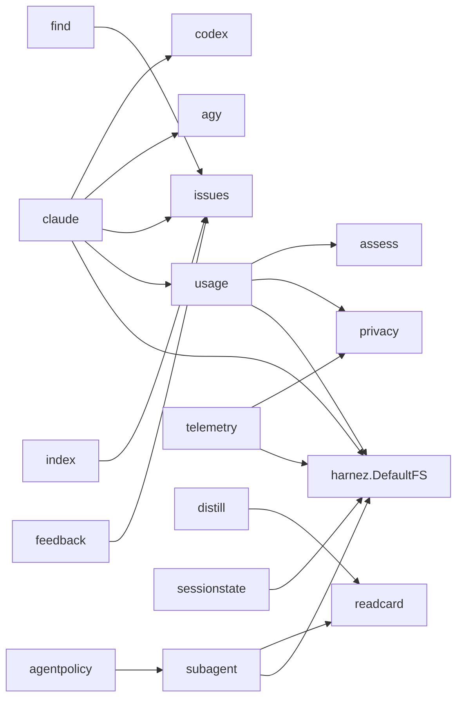
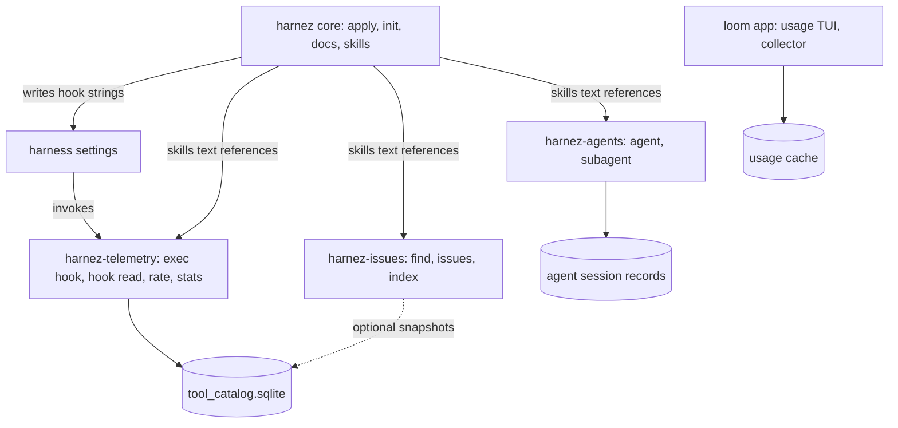

# Harnez Components — Coupling Analysis & Separation Boundaries

Findings report for issue 489. Scope: can the single `harnez` binary be split into
composable tools (docs/skills core, agents, init, telemetry), and what would that cost?
No code was changed; all numbers come from `go list` over the module at `def6d1a`.

## 1. Current Architecture

One Go module (`ubunatic.com/harnez`), one binary (~23 MB), one version (`version.go`),
one embedded asset tree (`embed.go`: `config.yaml`, `docs/{commands,lang,other,practices,templates}`,
`systemd/`, `spec/`). `cmd/harnez` (70 files) wires every subsystem; `internal/` holds
29 packages.

The `internal/` package graph is already shallow and almost acyclic by subsystem.
All cross-subsystem coupling is concentrated in three places:

1. `cmd/harnez` — every command file lives in one `main` package.
2. The root package `harnez.DefaultFS` — the embedded spec/docs tree.
3. Runtime contracts — hook command strings, the shared SQLite store, `config.yaml`.

### 1.1 Subsystems as they exist today

| Subsystem | Packages | Commands | External deps |
|---|---|---|---|
| **Docs/skills core** (apply) | `claude`, `codex`, `agy`, `markdown`, `jsonc`, `fsutil`, `mode` | `apply`, `diff`, `clean`, `status`, `revert`, `docs`, `docs cards`, `mode`, `scan-docs` | `toml` (codex) |
| **Init** | `claude` (`init.go`, `maketargets.go`, `gowork.go`), `assess` | `init` | — |
| **Agents** | `subagent`, `agentpolicy`, `sessionstate`, `compactcheck` | `agent *`, `subagent`, `compact-check` | `creack/pty`, `x/term` |
| **Telemetry** (hooks + store) | `telemetry`, `privacy`, `resolve`, `distill`, `quota1` | `exec hook`, `hook read`, `codex-hook`, `codex-telemetry`, `rate`, `log`, `stats`, `export`, `distill` | `modernc.org/sqlite` |
| **Usage/quota monitor** | `usage`, `rograph`, `uix`, `statusline`, `assess` | `usage`, `load-stream`, `history`, `timeline`, `fetch`, `record`, `agent-collector`, `statusline`, `assess`, `dochistory` | `voxi`, `go-runewidth` |
| **Issue tracker** | `issues`, `find`, `index`, `feedback` | `issues *`, `find`, `index`, `feedback` | — |
| **Shared libraries** | `readcard`, `fsutil`, `markdown` | `read` | — |
| **Standalone tools** | `release`, `bench`, `lint`, `gitstatus` | `release`, `bench`, `lint`, `repo-status` | sqlite (bench) |

The ticket's four-way split misses two subsystems that are as large as the ones it names:
the usage/quota monitor (`internal/usage`, 55 files, the largest package) and the issue
tracker. Any separation plan has to place them. The usage TUI is already slated to move out
of harnez into a `../loom` app, which settles its placement (see §4, item 3).

## 2. Coupling Analysis

### 2.1 Package-level imports (`internal/` only)

Cross-subsystem edges, with the exact symbols used:

| Edge | Symbols | Nature |
|---|---|---|
| `claude → issues` | `issues.Lint` | apply/status lints the tracker — incidental |
| `claude → usage` | `usage.LoadLocalConfig` | reads local usage config — incidental |
| `claude → codex`, `claude → agy` | `Apply`, `Remove`, `Status`, `Summary`, debloat | per-harness installers — intrinsic to apply |
| `subagent → readcard` | provider detection, `RenderBundleCard`, `CheckCard` | shared library, not a subsystem dependency |
| `telemetry`, `usage`, `subagent`, `sessionstate`, `claude → ROOT` | `DefaultFS` (`spec/*.yaml`, `config.yaml`) | shared embedded assets |

There is **no** package-level edge between agents and telemetry, agents and docs, or
telemetry and docs. The agent subsystem does not record its token costs into the
telemetry store (`subagent.Session` keeps its own counters).

### 2.2 Command-level coupling (`cmd/harnez`)

The real coupling is in command files that compose several subsystems:

| Command file | Composes | Why it matters |
|---|---|---|
| `exec.go` (`exec hook`) | telemetry + distill + quota1 + `claude.OpenConfig` | the one PreToolUse/Bash hook; distill rewrite composed inside it (issue 116/118, `docs/HookRewritePattern.md`) — cannot be split into two hooks |
| `hook.go` (`hook read`) | readcard reading discipline + telemetry | same single-hook constraint for Read/View |
| `stats.go` | telemetry + `claude.Config` | `--overhead` sizes installed instruction text |
| `find.go`, `index.go` | issue tracker + telemetry | write issue-status snapshots into the store |
| `main.go` | apply + usage + telemetry + sessionstate + agy/codex | root command and ~15 subcommands in one file |
| `init.go` | `claude` + `assess` | init reuses the apply package's config and doc machinery |
| `agent.go` | subagent + agentpolicy + privacy | self-contained |

### 2.3 Runtime contracts

These do not show up in `go list` but bind the subsystems harder than imports do:

1. **Hook command strings.** `apply` writes `harnez exec hook`, `harnez hook read`,
   `harnez codex-hook`, and the agy wildcard hook into harness settings. Apply (docs core)
   thus installs telemetry entry points by binary name.
2. **Skills and docs text reference other components' CLIs.** Managed AGENTS.md blocks and
   skills tell agents to run `harnez find`, `harnez issues`, `harnez rate`, `harnez read -I`,
   `harnez agent start`. Installing docs without those binaries yields instructions that fail.
3. **Shared store** `~/.harnez/tool_catalog.sqlite` — written by hooks, `rate`, `log`,
   `index`, `find`, CLI self-logging (`clilog.go`); read by `stats`, `export`, attribution.
4. **Shared config** `config.yaml` — one file with sections for every subsystem
   (`docs_profiles`, `hooks`, `exec`, `distill_autopipe`, `skills`, `agents_md`, `debloat`,
   `permissions`, `status_line`). `claude.Config` is the only parser.
5. **Shared spec** `spec/*.yaml` via `DefaultFS`: `telemetry.yaml`, `agent.yaml`,
   `reminders.yaml`, `actions/colors/indicators.yaml` (usage TUI).
6. **systemd unit** `harnez-agent-collector.service` — installed by apply, runs a usage command.

## 3. Use-Case Coverage

| Workflow | Needs |
|---|---|
| Install doc profiles/skills into `~/.claude`, `~/.codex`, `~/.gemini` | docs core |
| Bootstrap a project (AGENTS.md, doc copies, Makefile) | init + docs core (shared config/doc sources) |
| Hook setup + tool-call telemetry, docs managed elsewhere | telemetry + hook installer (today: apply) |
| Read-discipline hook / PNG cards | telemetry hook + readcard |
| Distill autopipe | telemetry (`exec hook`) — inseparable by design |
| Cross-harness subagents (`harnez agent`) | agents only; readcard optional |
| Orchestrated sprints (`/sprint`, OrchestratedAgentFlow) | agents + docs core (skills) + issue tracker + telemetry (`rate`, Quota-1) |
| Quota/usage dashboard, statusline, collector | usage monitor |
| Issue tracking (`find`, `issues`, `index`) | issue tracker; telemetry optional (snapshots) |
| Releases | release (standalone) |

The motivating use cases in the ticket map as follows: "docs without hooks/agents" works
today via config (empty `hooks:`, native subagent mode) but still ships the whole binary;
"hooks + telemetry only" is blocked by apply owning hook installation; "agents in
isolation" is closest to extractable already.

## 4. Proposed Boundaries

Ordered by how cheap each extraction is:

1. **Agents — cleanest seam.** `subagent` + `agentpolicy` + `compactcheck` + `agent*.go`
   depend only on `readcard` (for provider detection and bundle cards) and
   `spec/agent.yaml`. Required public surface: a provider-detection helper (move out of
   `readcard` into a tiny shared package) and the agent spec. Carries `creack/pty` and
   `x/term` out of the core binary.
2. **Issue tracker.** `issues`/`find`/`index`/`feedback` are self-contained. Seam: the
   optional snapshot write into the telemetry store, and `claude → issues.Lint`.
   Make both optional (store absent → skip; lint via subprocess or dropped from apply).
3. **Usage monitor — leaving harnez.** The `usage` TUI is planned to become a `../loom` app,
   so it is not a harnez component at all. Largest package, own deps (`voxi`, runewidth),
   own spec files (`actions/colors/indicators.yaml`). Seams to cut when it moves:
   `claude → usage.LoadLocalConfig`, the `harnez-agent-collector` systemd unit apply installs,
   and `statusline`/`assess` if they go along. Keep collector snapshots (`harnez usage --json`
   schema) as the contract if harnez still needs quota data, e.g. for agent dispatch.
4. **Telemetry.** The hardest. `exec hook` must stay one process that composes distill,
   quota1, and recording; `hook read` must compose read discipline and recording. So the
   telemetry tool owns distill, quota1, and the read-discipline hook — i.e. it is the
   "hooks" tool, not just a store. Seams: hook installation (move from apply to a
   `harnez-telemetry install` or make apply emit hooks only if the binary is on PATH),
   the store schema (`spec/telemetry.yaml`) becoming a published contract for readers
   like `stats` and `find`, and `stats --overhead` reading `claude.Config`.
5. **Init — do not split.** `init` shares `claude.Config`, doc-name expansion, profiles,
   and managed-section writing with apply. `docs/CLIDesign.md` separates their *targets*
   (global vs. project), not their machinery. A separate binary would duplicate the doc
   source and config loader. Recommendation: keep init and apply in the core tool.

Data flow after a split:

## 5. Independent Deployability

- **Module layout.** Separate binaries do not need separate repos: one module with several
  `cmd/` mains gives separate binaries sharing `internal/` today. Separate *versions*
  require either multiple modules (a `go.work` already exists) or per-binary version files
  that `harnez release` and `version.yaml` do not yet support (`docs/GoRelease.md`).
- **Embedded assets.** `DefaultFS` embeds everything into every binary. Each tool needs its
  own embed of just its spec files; the docs tree belongs to core only.
- **Config.** Either every tool keeps parsing the shared `config.yaml` (needs a small
  shared config package, split out of `claude`), or each gets its own file. A shared file
  with per-tool sections is the smaller change.
- **Binary size.** `modernc.org/sqlite` (pure-Go SQLite) is the heaviest dependency and is
  used only by telemetry and bench. A core without it would be much smaller; not measured
  here.

## 6. Migration & Compatibility Notes

- **Hook strings are persisted in user settings.** Renaming `harnez exec hook` to
  `harnez-telemetry hook` breaks every installed settings file until the next apply.
  Keep `harnez <old-subcommand>` as a forwarding shim (exec the sibling binary) for at
  least one release.
- **Skill/doc text.** Managed blocks referencing `harnez find` etc. must keep working;
  a dispatcher `harnez <cmd>` that execs `harnez-<component>` when present (git-style
  plugin lookup) preserves every documented command line unchanged.
- **Degradation.** Core must tolerate missing components: skip installing hooks whose
  binary is absent, and omit skill text for absent components (or gate it via docs
  profiles, which already exist).
- **Tests.** `scripts/smoke-test.sh` and the apply drift tests assume one binary; they need
  a multi-binary install step.

## 7. Conclusions

- Package-level coupling is low; the split is mostly a `cmd/` and runtime-contract
  problem, not an `internal/` refactor.
- Extraction order by cost: agents, issue tracker, then telemetry. The usage monitor leaves
  harnez entirely for a `../loom` app. Init stays with core.
- The telemetry tool is really the "hooks" tool: distill, quota1, and read discipline
  live in the same hook processes and must move together.
- The lowest-risk path to user-visible composability is a git-style dispatcher in core
  plus per-component binaries built from the same module, before any repo or version split.

Follow-up design work is tracked in issue 490; the design is §8.

## 8. Component System Design (issue 490)

Goal from 490: let users adopt parts of harnez — docs/skills without hooks, hooks and
telemetry without docs, agents alone — instead of all or nothing. This section compares
the paths forward, recommends one, and specifies it.

### 8.1 Paths considered

| Path | What it is | Solves | Costs | Reversible |
|---|---|---|---|---|
| **E. Status quo** | Users hand-write a `config.yaml` (`hooks: []`, `status_line: false`, no skills) and pass `-c` | selection, today, zero code | no removal of already installed hooks; users fork the whole config and miss upstream changes; embedded config stays all-or-nothing | — |
| **A. Component selection in the monolith** | `components:` key + `apply --components`; apply phases gated per component | all four 490 use cases at install time | small: one filter in `internal/claude`; no binary or release change | yes, config-only |
| **B. Multi-binary, one module** | `cmd/harnez-agents`, `cmd/harnez-telemetry` …; `harnez <cmd>` git-style dispatch to `harnez-<cmd>` on PATH | binary size and deps (sqlite, pty), per-component install | release pipeline builds N binaries; hook/skill strings need forwarding shims; smoke tests go multi-binary | mostly; forwarding shims stay |
| **C. Separate repos/modules** | each component its own repo and version, like `usage` → `../loom` | independent cadence and ownership | cross-repo contracts for spec, config, store; N release pipelines; uman coordination | costly |
| **D. Component manifests (plugin protocol)** | core `apply` becomes a generic installer; each component ships a manifest declaring its hooks, skills, docs, status line, units | third-party components (loom's collector, uman) plug into apply without code in harnez | a new public contract to design and version; over-engineered while all components live here | costly once others depend on it |

Evaluation against the 490 use cases:

| Use case | E | A | B | C | D |
|---|---|---|---|---|---|
| Docs/skills, no hooks or agents | partial (no removal) | yes | yes | yes | yes |
| Hooks + telemetry only | partial | yes | yes | yes | yes |
| Agents alone with own cost tracking | runtime already works | yes | yes, smaller binary | yes | yes |
| Different versions per subsystem | no | no | no (one release) | yes | yes |
| Smaller install footprint | no | no | yes | yes | depends |

### 8.2 Recommendation

Take **A now**, and treat B, C, D as later steps with explicit triggers rather than as the
plan of record:

- **A first** because every 490 use case is about *what gets installed into the harness*,
  and that is decided by `apply`, not by how many binaries exist. A is config-only,
  default-preserving, and its component names become the binary or repo names if B or C
  follow, so no work is thrown away.
- **B when** binary size or a heavy dependency becomes a user complaint, or a component
  needs to be installable without the rest (e.g. telemetry hooks on a machine that must
  not carry agent PTY code). Precondition: `harnez release` supports multiple binaries.
- **C only** for components with a different owner, audience, or cadence. `usage` already
  qualifies and is moving to `../loom`; nothing else does today.
- **D when** a component outside this repo needs to install into harnesses through
  `apply` (the loom collector's systemd unit is the first candidate). Until then, the
  per-component gating in A is the manifest, just compiled in.

E remains the fallback for one-off setups and costs nothing to keep.

### 8.3 Components

| Component | Apply installs | Runtime commands (unchanged by selection) |
|---|---|---|
| `docs` | global copyable docs (`docs:`, `apply --docs`), managed CLAUDE.md/AGENTS.md convention sections | `docs`, `mode`, `read` |
| `skills` | commands and skills into Claude, Codex, Gemini, Prime targets | — |
| `telemetry` | harnez hooks in Claude `settings.json` (`exec hook`, `hook read`), Codex and AGY hooks, distill adapters, the Tool Feedback Protocol section and skill, telemetry schema init | `exec`, `hook`, `rate`, `log`, `stats`, `export`, `distill` |
| `agents` | skills that declare `requires: [agents]` | `agent`, `subagent`, `compact-check` |
| `usage` (transitional) | `statusLine`, `harnez-agent-collector` systemd unit | `usage`, `statusline`, … until moved to loom |

Always applied regardless of selection: `model`, `effortLevel`, `permissions`, `env`,
`spinnerVerbs`, `mcpServers`, decommissioned-artifact cleanup, bash shims. These are
harness settings, not component features.

The issue tracker (`issues`, `find`, `index`) stays in core: it installs nothing into
harnesses, and the docs and skills that name its commands ship with it.

Presets, from 490:

| Preset | Components |
|---|---|
| `full` (default) | all |
| `docs-only` | `docs`, `skills` |
| `telemetry-only` | `telemetry` |
| `agents-only` | `agents` |

Presets and component names mix freely: `--components docs-only,telemetry`.

**Naming:** 490 proposed `apply --profile=<name>`. `profile` is already taken by
`docs_profiles` (`core`, `dev`, `full` sets of docs), and `full` exists in both. Reusing
the word would make `--profile full` ambiguous. The design uses `components:` and
`--components`; presets are values of it.

### 8.4 Semantics of a disabled component

Two behaviours, chosen by how harmful a leftover is:

- **Remove** harness entry points that call harnez: hooks whose command starts with
  `harnez `, Codex and AGY harnez hooks, a `statusLine` whose command is `harnez …`, the
  Tool Feedback Protocol section and skill, and skills whose `requires:` names a disabled
  component. A leftover hook calling an unwanted or missing binary breaks or slows every
  tool call; a leftover skill tells agents to run commands that are not wanted. This
  extends the existing precedent of `feedback.disable_rate_protocol` (issue 142), which
  already removes rather than skips.
- **Skip** docs, commands, and skills of a disabled component: apply stops managing them
  but does not delete them. A stale doc is harmless and may belong to another tool.

Ownership rule: harnez owns a hook or status line when its command is `harnez` or starts
with `harnez `. Nothing else is removed. The Stop sound hook in the default config is not
harnez-owned and survives every selection.

### 8.5 Selection and persistence

Resolution order: `apply --components` > `components:` in the loaded config > `full`.

A flag alone is not persistent: the next plain `harnez apply` would reinstall everything,
and `harnez diff`/`status` would report the deselected parts as drift. Options:

1. **Require a custom config** for persistent selection. Simple, but pushes users back to
   path E for a one-line choice.
2. **Persist to the user-local config** `~/.harnez/config.yaml` (`components: [...]`),
   written by `apply --components … --save`. It is a machine-local choice ("no telemetry
   on this box"), which is what that file is for.
3. **Record the last selection** in a state file under `~/.harnez/` and reuse it silently.
   Surprising; rejected.

Recommended: 2. The loader for that file lives in `internal/usage` today
(`usage.LoadLocalConfig`), which is moving to loom, so it moves to a neutral package
first. That also removes the `claude → usage` edge from §2.1.

`diff`, `status`, and `apply` resolve the selection through one function, so all three
agree on what counts as drift.

### 8.6 Composition contracts

Components never call each other's Go code across the boundary. They compose through
files and command lines, which is what makes B and C possible later:

| Contract | Producer | Consumers | Defined in |
|---|---|---|---|
| Hook command strings (`harnez exec hook`, `harnez hook read`, `harnez codex-hook`) | `telemetry` via apply | Claude, Codex, AGY | `config.yaml` `hooks:`, `internal/codex`, `internal/agy` |
| `~/.harnez/tool_catalog.sqlite` | `telemetry` | `stats`, `export`, issue snapshots | `spec/telemetry.yaml` |
| Agent session records (`~/.harnez/agents/`) | `agents` | `agent list/status`, a future telemetry import | `internal/subagent` (to be specced) |
| Usage snapshots (`harnez usage --json` schema) | `usage` collector (→ loom) | `usage`, statusline, agent dispatch | `internal/usage` (to be specced) |
| `config.yaml` sections | user | every component | `claude.Config` |
| `requires:` on skills | skill authors | apply | `config.yaml` `skills:` |

"Agents in isolation with direct token cost tracking" (490 use case 3): agent sessions
already keep token counters in their own records (`subagent.Session`), so agents-only
works without the telemetry store. When both components are enabled, telemetry imports
agent session records; agents do not write into the store. This keeps the dependency
one-way (telemetry reads agents' contract), and agents stay free of sqlite.

### 8.7 Initialization order

`apply` phases, each gated by the selection and depending only on config, not on another
phase's output:

1. Resolve selection (flag > config > local config > full); filter config.
2. Telemetry schema init — only with `telemetry` (today it runs unconditionally).
3. Decommissioned-artifact cleanup — always.
4. `settings.json` — one merged write: always-on settings, hooks of enabled components
   (the `hooks` key is written even when empty, so hooks of disabled components are
   replaced away), `statusLine` set or removed.
5. Commands and skills — `skills`; per-skill removal when `requires:` is unmet.
6. Codex and AGY hooks — apply with `telemetry`, remove without.
7. Distill adapters — `telemetry`.
8. Global docs — `docs`.
9. Shims and shell rc — always (unchanged).
10. systemd collector unit — `usage` and `--systemd`.

Because settings are written in one merge (step 4) and no later step reads them, each
preset boots independently, and presets compose by union.

### 8.8 Migration

- Default is `full`, so existing users see no change.
- Switching `full` → `docs-only` removes harnez hooks, the status line, and the Tool
  Feedback Protocol, and keeps docs and skills. Switching back reinstalls them.
- If B follows, each component maps 1:1 to a binary and the selection also decides which
  binaries a `harnez install` fetches. Hook strings keep working through the dispatcher.
- `usage` drops out of the component list when it moves to loom; a saved selection that
  names it is accepted with a deprecation note for one release.

### 8.9 Open questions

- **Sprint skills and `agents`.** `sprint`, `lean-sprint`, and `reverse-sprint` name
  `harnez agent start`, but repos can run them with `subagent_mode: native`. Should they
  declare `requires: [agents]` (removed in docs-only) or stay unconditional and rely on the
  native fallback text?
- **Project-level selection.** `init` writes managed AGENTS.md blocks that name
  `harnez find`, `harnez read`, and the rate protocol. Should `init` honour a selection
  too? Per `docs/CLIDesign.md`, that would be a separate project-local setting, not the
  global one.
- **Telemetry import of agent sessions.** It does not exist yet and is not required for
  the prototype.

### 8.10 Prototype and verification plan

Prototype scope (path A, phases 1–10 above, without `--save` persistence):

- `internal/claude/components.go`: component names, presets, `ParseComponents`,
  `Config.SelectComponents(override)`.
- `Config.ComponentNames` (`components:`) and `Command.Requires` (`requires:`).
- Gates in `ApplyAllVariant`, the `hooks`/`statusLine` handling in `buildSettingsDoc`, and
  a nil-means-remove-if-harnez-owned rule in `applyMerge`; the same gates in `DiffAll`.
- `apply --components` flag; skip the telemetry schema init without `telemetry`.

Verification:

- Unit: preset and name parsing, unknown names rejected, nil set means full.
- Integration: apply `telemetry-only` into a temp target, then `docs-only`; assert harnez
  hooks, status line, and the rate skill are gone, the Stop hook and user keys survive,
  and `diff` reports no drift under the same selection.
- Review checklist: each preset boots on an empty target; presets compose by union;
  `full` output is byte-identical to today's apply.
