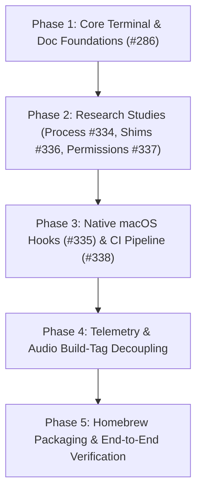

# macOS Portability & OS-Agnostic Architecture

Architecture decisions, platform boundaries, and implementation strategy for transitioning `harnez` from a Linux-first tool to an OS-agnostic system, prioritizing macOS (Darwin) as the primary non-Linux tier.

---

## 1. Design Principles & Strategy

1. **Zero Degraded Experience on Linux**: Existing Linux workflows, low CPU footprint, and telemetry fidelity must remain untouched.
2. **Standard Go Cross-Platform Libraries First**: Prefer standard, stdlib-adjacent libraries (e.g. `golang.org/x/term`, `golang.org/x/sys/unix`) over shelling out to CLI tools or bespoke unsafe ioctl code.
3. **Graceful Degradation for Platform-Specific Hardware Features**:
   - Hardware telemetry (CPU per-core meters, RAM breakdown, thermals) that relies on `/proc` or `/sys` can remain Linux-first initially; on macOS, unsupported graphs are gracefully hidden or simplified (e.g. in compact view).
   - Audio/mic activity monitoring is a nice-to-have feature that degrades gracefully to `MicUnavailable` when platform audio servers are absent, with native macOS CoreAudio probes added incrementally.
4. **Compile-Time Build Tag Isolation**: OS-specific implementations are partitioned cleanly using Go build tags (`_linux.go`, `_darwin.go`, `_fallback.go`) behind uniform internal interfaces.

---

## 2. Subsystem Architecture & Portability Plan

### 2.1 Terminal & Console I/O
- **Status**: Tracked in [issue #286](file:///home/uwe/projects/harnez/issues/286-promote-golang-org-x-term-for-terminal-operations-in-go-conventions.md) (Bucket: **Now**).
- **Strategy**: Replace all `stty -F /dev/tty size` and `stty cbreak -echo` subprocess calls in [`internal/usage/watch.go`](file:///home/uwe/projects/harnez/internal/usage/watch.go) with `golang.org/x/term` (`term.GetSize`, `term.MakeRaw`, `term.Restore`).
- **Benefit**: Completely cross-platform, zero subprocess overhead, eliminates GNU vs BSD `stty` flag incompatibilities.

### 2.2 Process Inspection & Agent Counting
- **Status**: Research tracked in [issue #334](file:///home/uwe/projects/harnez/issues/334-research-os-agnostic-process-inspection-across-macos-and-linux.md).
- **Strategy**: Replace `ps -eo comm=` in [`internal/usage/process.go`](file:///home/uwe/projects/harnez/internal/usage/process.go) with direct process table queries:
  - **Linux**: Direct `/proc/[pid]/comm` or `/proc/[pid]/stat` inspection.
  - **macOS (Darwin)**: `sysctl(KERN_PROC, KERN_PROC_ALL)` or `proc_listpids()` / `libproc` via `golang.org/x/sys/unix`.
- **Benefit**: Eliminates fork/exec overhead during rapid polling and avoids GNU vs BSD `ps` output quirks.

### 2.3 Audio Notifications & Lifecycle Hooks
- **Status**: Tracked in [issue #335](file:///home/uwe/projects/harnez/issues/335-support-afplay-audio-notifications-on-macos-in-default-hooks.md).
- **Strategy**: Support native macOS `afplay /System/Library/Sounds/Glass.aiff` for the `Stop` event hook alongside Linux `ffplay` / `paplay`.

### 2.4 Shell Interception Shim & Environment
- **Status**: Research tracked in [issue #336](file:///home/uwe/projects/harnez/issues/336-research-cross-platform-shell-shim-patterns-for-macos-and-linux.md).
- **Strategy**: Ensure `~/.harnez/shims/bash` and `~/.harnez/env.sh` handle macOS default `zsh`, Apple Silicon Homebrew paths (`/opt/homebrew/bin`), and POSIX `sh` fallback smoothly without breaking subshell environment propagation.

### 2.5 Security & Permission Whitelists
- **Status**: Research tracked in [issue #337](file:///home/uwe/projects/harnez/issues/337-research-macos-system-permissions-and-cli-whitelist-for-config-template.md).
- **Strategy**: Structure `permissions.allow` in `config.yaml` to include safe macOS CLI tools (`launchctl`, `diskutil`, `log show`, `brew`) and macOS system read paths (`/Library/**`, `/Applications/**`) alongside Linux equivalents.

### 2.6 System Hardware Telemetry & Audio Gating
- **Telemetry**:
  - `internal/usage/load.go` splits into `load_linux.go` (reading `/proc` and `/sys`) and `load_darwin.go` / `load_fallback.go`.
  - On macOS, `CPULoad` returns standard `getloadavg` load averages and basic memory metrics, leaving thermals/per-core graphs cleanly hidden if unavailable.
- **Audio Monitoring**:
  - `internal/usage/mic.go` detects backend availability; on macOS without PipeWire/Pulse/ALSA, returns `MicUnavailable` (displaying cleanly without breaking TUI layouts) until an optional CoreAudio probe is implemented.

### 2.7 CI Verification & Homebrew Distribution
- **Status**: Tracked in [issue #338](file:///home/uwe/projects/harnez/issues/338-macos-ci-verification-via-github-mirror-and-homebrew-release-packaging.md).
- **Strategy**:
  - Leverage the synced GitHub mirror (`ubunatic/harnez` on GitHub) to run GitHub Actions workflows on native macOS runners (`macos-latest` / Apple Silicon).
  - Configure GoReleaser v2 to publish formulas to a Homebrew tap for frictionless `brew install ubunatic/tap/harnez`.

---

## 3. Implementation Roadmap

1. **Immediate (Now)**:
   - Land issue #286 (`golang.org/x/term` for terminal operations).
2. **Next**:
   - Complete research studies (Process inspection #334, Shell shims #336, Permissions #337).
   - Implement `afplay` macOS notification support (#335).
   - Setup GitHub Actions macOS CI workflow (#338).
3. **Later**:
   - Refactor `load.go` and `mic.go` into OS-gated modules (`_linux.go`, `_darwin.go`, `_fallback.go`).
   - Configure Homebrew tap release automation in GoReleaser.
