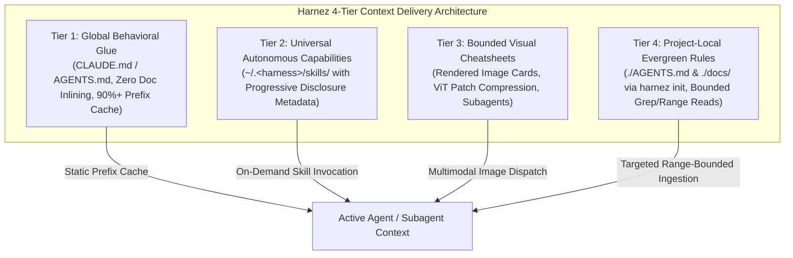

# Multimodal Context Delivery Architecture & Context Optimization Roadmap

## 1. Executive Summary

As multi-agent systems and nested subagent loops become standard in daily development, context window consumption and token economics dominate both latency and monetary cost. Traditionally, repository instruction documents (`docs/practices/AgenticLoop.md`, `docs/lang/*.md`, `AGENTS.md`) were inlined as raw text or eagerly dumped into context, consuming 15,000–30,000 tokens on every agent turn.

With the convergence of four architectural milestones:
1. **Zero Global Doc Inlining** (Issue 386 & Issue 389) making global doc installation strictly opt-in,
2. **Unified Cross-Harness Dynamic Skills** (Issue 388) across `claude`, `agy`, `codex`, and `prime`,
3. **Multi-Column Visual Cheatsheets & ViT Bounded Cards** (Issue 387, Issue 391, Issue 392) offering 2x–8.5x token compression,
4. **Isolated Subagent Dispatch & Mechanical Lint Canary** (Issue 393) proving 100% mechanical instruction compliance with zero text rules,

Harnez adopts a formal **4-Tier Context Delivery Architecture**.



---

## 2. The 4-Tier Context Delivery Architecture

### Tier 1: Global Behavioral Glue (Prefix Cached & Minimal)
- **Scope**: User global config (`~/.claude/CLAUDE.md`, `~/.codex/`, `~/.gemini/antigravity-cli/`, `~/.prime/`).
- **Payload**: Minimal, immutable operating invariants (e.g. Zero Zombie Guarantee, Quota-1 single-test boundary, single default branch rule).
- **Rule**: **Zero Doc Inlining**. No language or practice markdown files are eagerly concatenated into global context.
- **Economic Objective**: Maximize prompt prefix cache hits (>90% cache efficiency). Any mutation in Tier 1 invalidates the global prefix cache across all sessions.

### Tier 2: Universal Autonomous Capabilities (Dynamic Skills)
- **Scope**: Cross-harness skill definitions (`~/.claude/skills/`, `~/.gemini/antigravity-cli/builtin/skills/`, `~/.codex/skills/`).
- **Payload**: Standardized skill directories containing `SKILL.md`, tools, and reference scripts.
- **Progressive Disclosure Pipeline**:
  1. *Level 1 (Discovery)*: Light description and intent trigger in the tool index (~20–40 tokens).
  2. *Level 2 (Activation)*: Targeted `SKILL.md` instructions ingested into context only when triggered.
  3. *Level 3 (Execution)*: Auxiliary scripts and tools execute in background sub-processes without dumping raw code into context.

### Tier 3: Bounded Visual Cheatsheets (Multimodal Compression)
- **Scope**: High-density rendered image cards (`docs/vision/` / `scratch/vision/`).
- **Payload**: Styled 2-column or 3-column cheatsheets and 3-in-1 developer cards (`Bash` + `Make` + `Git`) rendered at 9.5px–11px monospace.
- **ViT Invariants**:
  - Max dimension kept $\le 1568\text{px}$ (preventing downscaling blur on Claude and OpenAI).
  - Tiled ViT patch encoders compress raw markdown from **6,473 text tokens** down to **765–1,032 vision tokens** (**6.3x to 8.5x net reduction**).
  - Used primarily for isolated subagent dispatches and on-demand reference lookups where text token budgets are constrained.

### Tier 4: Project-Local Evergreen Rules (Repository-Scoped)
- **Scope**: Repository root (`./AGENTS.md`, `./CLAUDE.md`, `./docs/`).
- **Payload**: Project-specific architectural invariants, domain rules, and local overlays (`AGENTS.local.md`).
- **Ingestion Discipline**:
  - Invariant 6 (Range-Bounded Ingestion): No whole-file dumping of `AGENTS.md` or large architecture specs.
  - Subagents and orchestrators query docs via targeted tools (`view_file` slices, `grep_search`, `harnez find`).

---

## 3. Provider ViT Economics & Resolution Matrix

| Model / Harness | Vision Token Formula | 3-in-1 Card Tokens *(1440×1400px)* | Raw Text Equiv | Compression Ratio | Downsampling Bound |
| :--- | :--- | :---: | :---: | :---: | :--- |
| **OpenAI / Codex** | $85 + 170 \times \lceil W/512 \rceil \times \lceil H/512 \rceil$ | **765** | 6,473 | **8.46x** | Max 2048px |
| **Google Gemini** | $258 \times \lceil W/384 \rceil \times \lceil H/384 \rceil$ | **1,032** | 6,473 | **6.27x** | Patch 384px |
| **Anthropic Claude**| $\approx (W \times H) / 750$ | **2,688** | 6,473 | **2.41x** | Max 1568px |

### ViT Resolution Thresholds:
- **$\le 7\text{px}$**: Glyph degradation, bracket ambiguity (`{` vs `[`, `:=` vs `!=`).
- **$9.0\text{px} - 9.5\text{px}$**: ViT lower bound for 100% OCR fidelity.
- **$10\text{px} - 11\text{px}$**: Optimal operational standard for cheatsheet generation.

---

## 4. Integration Roadmap & CLI Evolution

### 4.1 Subagent Dispatch Enhancements
Extend `harnez subagent` and command dispatch workflows to support multimodal doc attachment:
```bash
# Dispatch subagent with visual cheatsheet context:
harnez subagent --doc-mode=vision --card=dev-3in1 --task="Implement deploy-check.sh"

# Dispatch with lite text doc:
harnez subagent --doc-mode=lite --doc=Bash.lite.md --task="Refactor pipeline"
```

### 4.2 `harnez mode` Integration
Extend `harnez mode` to coordinate context density across tiers:
- `harnez mode full`: Standard text docs linked in `./docs/`.
- `harnez mode lite`: Lite text docs (`*.lite.md`) linked into project root.
- `harnez mode vision`: Visual cards rendered and symlinked for multimodal harnesses.

### 4.3 Automated Cheatsheet Builder
Integrate `scripts/canary-doc-vision/render.py` into a first-class harnez command:
- `harnez build-cards`: Compiles markdown files into bounded PNG cheatsheet cards with automatic layout optimization and 9.5px font-ladder validation.

---

## 5. Mechanical Verification Invariants

All multimodal instruction delivery must adhere to the verification principles validated in Issue 393:
1. **Isolated Scratch Execution**: Canaries and subagent tasks run in isolated workspaces with zero ambient text rules.
2. **Mechanical Linting**: Compliance is judged objectively by `harnez lint` / `internal/lint` AST and regex checks (`if test`, `set -euo pipefail`, `git -C`, `mktemp`+`trap`, `local` declarations) rather than subjective LLM self-assessment.
3. **Traceable Token Accounting**: All dispatches log exact pixel dimensions, ViT tile counts, and baseline text token comparisons.
