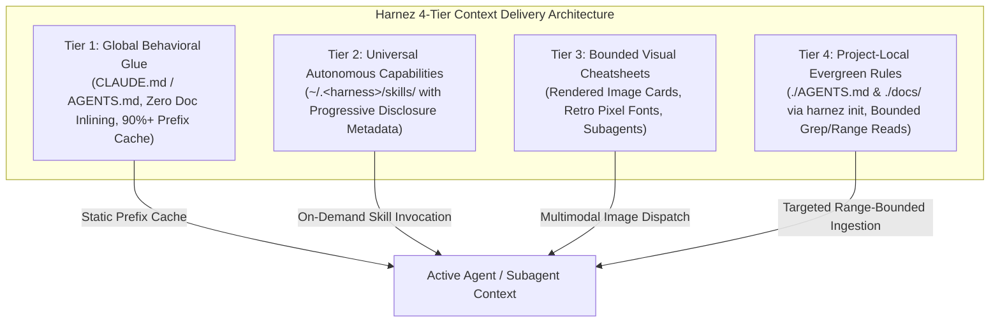

# Multimodal Context Delivery Architecture & Context Optimization Roadmap

## 1. Executive Summary

As multi-agent systems and nested subagent loops become standard in daily development, context window consumption and token economics dominate both latency and monetary cost. Traditionally, repository instruction documents (`docs/practices/AgenticLoop.md`, `docs/lang/*.md`, `AGENTS.md`) were inlined as raw text or eagerly dumped into context, consuming 15,000–30,000 tokens on every agent turn.

With the convergence of five architectural milestones:
1. **Zero Global Doc Inlining** (Issue 386 & Issue 389) making global doc installation strictly opt-in,
2. **Unified Cross-Harness Dynamic Skills** (Issue 388) across `claude`, `agy`, `codex`, and `prime`,
3. **Multi-Column Visual Cheatsheets & ViT Bounded Cards** (Issue 387, Issue 391, Issue 392) offering 2x–8.5x token compression,
4. **Isolated Subagent Dispatch & Mechanical Lint Canary** (Issue 393) proving 100% mechanical instruction compliance with zero text rules,
5. **Native 1-Bit Retro Pixel Font Engine** (Issue 398 & Issue 400) eliminating anti-aliasing gray-bleed and unlocking up to 10.5x compression on micro-canvases,

Harnez adopts a formal **4-Tier Context Delivery Architecture**.



---

## 2. The 4-Tier Context Delivery Architecture

### Tier 1: Global Behavioral Glue (Prefix Cached & Minimal)
- **Scope**: User global config (`~/.claude/CLAUDE.md`, `~/.codex/`, `~/.gemini/antigravity-cli/`, `~/.prime/`).
- **Payload**: Minimal, immutable operating invariants (e.g. Zero Zombie Guarantee, Quota-1 single-test boundary, single default branch rule).
- **Rule**: **Zero Doc Inlining**. No language or practice markdown files are eagerly concatenated into global context.
- **Economic Objective**: Maximize prompt prefix cache hits (>90% cache efficiency). Any mutation in Tier 1 invalidates the global prefix cache across all sessions.

### Tier 2: Universal Autonomous Capabilities (Dynamic Skills)
- **Scope**: Cross-harness skill definitions (`~/.claude/skills/`, `~/.gemini/skills/`, `~/.codex/skills/`, `~/.prime/agent/skills/`).
- **Payload**: Standardized skill directories containing `SKILL.md`, tools, and reference scripts.
- **Progressive Disclosure Pipeline**:
  1. *Level 1 (Discovery)*: Light description and intent trigger in the tool index (~20–40 tokens).
  2. *Level 2 (Activation)*: Targeted `SKILL.md` instructions ingested into context only when triggered.
  3. *Level 3 (Execution)*: Auxiliary scripts and tools execute in background sub-processes without dumping raw code into context.

### Tier 3: Bounded Visual Cheatsheets (Multimodal Compression)
- **Scope**: High-density rendered image cards (`docs/vision/`, `harnez read -I`, `harnez docs cards`).
- **Payload**: Styled 2-column or 3-column cheatsheets and 3-in-1 developer cards (`Bash` + `Make` + `Git`) rendered using 1-bit crisp bitmap fonts (`Font5x8` default, `Font3x5` micro).
- **ViT Invariants**:
  - Max dimension kept $\le 1568\text{px}$ (preventing downscaling blur on Claude and OpenAI).
  - Tiled ViT patch encoders compress raw markdown from **6,473 text tokens** down to **765–1,032 vision tokens** (**6.3x to 8.5x net reduction**).
  - Used for isolated subagent dispatches, `harnez read -I` file inspections, and on-demand reference lookups.

### Tier 4: Project-Local Evergreen Rules (Repository-Scoped)
- **Scope**: Repository root (`./AGENTS.md`, `./CLAUDE.md`, `./docs/`).
- **Payload**: Project-specific architectural invariants, domain rules, and local overlays (`AGENTS.local.md`).
- **Ingestion Discipline**:
  - Invariant 6 (Range-Bounded Ingestion): No whole-file dumping of `AGENTS.md` or large architecture specs.
  - Subagents and orchestrators query docs via targeted tools (`view_file` slices, `grep_search`, `harnez find`, `harnez read`).

---

## 3. Provider ViT Economics & Resolution Matrix

| Model / Harness | Vision Token Formula | 3-in-1 Card Tokens *(1440×1400px)* | Raw Text Equiv | Compression Ratio | Downsampling Bound |
| :--- | :--- | :---: | :---: | :---: | :--- |
| **OpenAI / Codex** | $85 + 170 \times \lceil W/512 \rceil \times \lceil H/512 \rceil$ | **765** | 6,473 | **8.46x** | Max 2048px |
| **Google Gemini** | $258 \times \lceil W/384 \rceil \times \lceil H/384 \rceil$ | **1,032** | 6,473 | **6.27x** | Patch 384px |
| **Anthropic Claude**| $\approx (W \times H) / 750$ | **2,688** | 6,473 | **2.41x** | Max 1568px |

### ViT Resolution & Rasterization Rules:
- **Vector Anti-Aliased Fonts**: Below 9px, anti-aliasing gray-bleed degrades `{` vs `[`, `:=` vs `!=`.
- **Pure 1-Bit Retro Pixel Fonts (`Font5x8`)**: Pure binary contrast eliminates gray-bleed entirely, delivering 100% OCR fidelity down to 7px/8px cells.
- **Canvas Boundaries**:
  - $256 \times 256\text{px}$: 87 tokens on Claude, 255 on OpenAI $\to$ **$7.6\times$ compression** in $3\times5$ font.
  - $512 \times 512\text{px}$: 255 tokens on OpenAI, 258 on Gemini $\to$ **$10.5\times$ compression** in $3\times5$ font.
  - $1564 \times 1568\text{px}$: Multi-column card fitting full language or practice documentation bundles.

---

## 4. CLI Implementation & Operational Commands

### 4.1 Visual File Inspection (`harnez read -I`)
Render source files directly into bounded, syntax-highlighted visual cards:
```bash
# Render file with default 5x8 retro pixel font and multi-column packing:
harnez read -I internal/lint/lint.go

# Read specific line ranges with column wrapping:
harnez read -I --lines 1:120 --columns 2 cmd/harnez/main.go
```

### 4.2 Automated Cheatsheet Builder (`harnez docs cards`)
Compile repository markdown documentation into bounded visual PNG cards:
```bash
# Compile standard 3-in-1 bundle (Bash + Make + Git) into docs/vision/:
harnez docs cards build --bundle=dev-3in1 --out=docs/vision/

# Validate card dimensions and font resolution against ViT bounds:
harnez docs cards check docs/vision/*.png
```

### 4.3 Subagent Dispatch & Doc Modes
Coordinate context delivery across agent harnesses:
- `harnez mode vision` (or `harnez mode 4`): Activates visual documentation tier.
- Subagent launcher stages `STYLE_GUIDE.png` and provides multimodal context headers with zero text injection.

---

## 5. Mechanical Verification Invariants

All multimodal instruction delivery adheres to three verification principles:
1. **Isolated Scratch Execution**: Canaries and subagent tasks execute in clean scratch workspaces without ambient text rules.
2. **Mechanical Linting**: Compliance is judged objectively by `harnez lint` / `internal/lint` AST and regex checks (`if test`, `set -euo pipefail`, `git -C`, `mktemp`+`trap`, `local` declarations) rather than subjective LLM self-assessment.
3. **Traceable Token Accounting**: All visual dispatches log exact pixel dimensions, ViT tile counts, and baseline text token comparisons.
