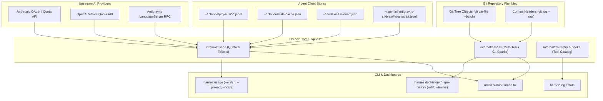

# Telemetry and Evolution Architecture

Documents the multi-layered telemetry, usage tracking, and Git artifact evolution architecture in `harnez`.

---

## 1. System Overview & Sourcing Layers

`harnez` gathers developer and agent telemetry across four distinct layers without impacting active agent context windows:

---

## 2. Multi-Agent Usage & Quota Telemetry (`internal/usage/`)

### 2.1 Live Quotas vs. Raw Token Accounting
1. **Live Quotas (Rolling Capacity Windows)**:
   - Polled periodically from upstream endpoints and cached in `harnez-quota-cache.json`.
   - Upstream providers disclose **utilization percentages** and `reset_at` timestamps (e.g. 5-hour session burst and 7-day rolling window).
   - Providers conceal raw capacity denominators (absolute token ceilings).
2. **Time-Series Quota Snapshotter (`quota-history.jsonl`)**:
   - `AppendQuotaHistoryForAgent` records timestamped quota states upon cache refresh.
   - Enforces a 15-minute cross-process file lock (`flock`) and deduplication interval to prevent log spam during rapid `--watch` intervals.
3. **Multi-Node Fleet Federation**:
   - Per-host snapshot logs (`t14.jsonl`, `x600.jsonl`, `um760.jsonl`) in `~/.claude/harnez/usage-history/`.
   - Remote fetch via `harnez usage history fetch <host>` merges fleet-wide timelines and computing unified burn velocity.

### 2.2 Project-Level Token Attribution & Cost-of-Change
- `CollectProjectUsage(repoPath)` scans Claude Code, AGY, and Codex session stores and filters sessions matching the target working directory (`cwd` / `workspacePaths`).
- Correlates cumulative token spend against repository changes to compute:
  - **Tokens / Net Code LOC Added**: Generative throughput ratio.
  - **Tokens / Shipped Ticket**: Average AI compute cost per sprint task.
  - **Prompt Cache Leverage Ratio**: Cache read vs. raw write efficiency.

---

## 3. Git Artifact Evolution & Braille Sparklines (`internal/assess/`)

### 3.1 Multi-Track Git Classification
The Git evolution engine inspects commit trees via `git cat-file --batch` in sub-100ms runtime (zero disk checkouts), classifying blobs into five functional tracks:
- **`Code`**: Source code files (`*.go`, `*.rs`, `*.py`, `*.c`, `*.sh`, `*.ts`) excluding tests.
- **`Tests`**: Test files (`*_test.go`, `test_*.py`, `tests/**`) calculating test/code ratio.
- **`Docs`**: Markdown documentation (`docs/**/*.md`, `README.md`, `AGENTS.md`) excluding tickets.
- **`Skills`**: Agent skill declarations (`skills/**/SKILL.md`, `commands/*.md`).
- **`Issues`**: Issue tracker tickets (`issues/*.md`), tracking open vs. closed velocity.

### 3.2 Double-Resolution Braille Sparkline Engine
Using Unicode Braille patterns (`\u2800`–`\u28FF`):
- **2 Samples per Terminal Cell**: Left column encodes dots 1, 2, 3, 7; right column encodes dots 4, 5, 6, 8.
- A 10-character box displays **20 discrete time points** with 4 vertical levels per sub-column.
- **Baseline Zero**: Renders as `⣀` (`\u28C0` — dots 7 and 8) rather than empty whitespace or mid-height blocks.
- **Delta Velocity Color Tinting**:
  - Green (`\x1b[32m`): Growth / additions dominant ($v_{i+1} > v_i$).
  - Red (`\x1b[31m`): Pruning / removals dominant ($v_{i+1} < v_i$).
  - Muted/Default: Steady state ($v_{i+1} == v_i$).

### 3.3 Additions vs. Removals Breakdown (`--diff`)
- Evaluates consecutive sampled commit deltas to compute separate cumulative addition ($CumA$) and removal ($CumR$) trajectories.
- Allows developers to distinguish clean continuous additive progress from heavy restructuring/refactoring churn.

---

## 4. CLI Invocations & Commands Reference

| Command | Scope | Description |
| :--- | :--- | :--- |
| `harnez usage` | Fleet / Agent | Live multi-agent token counters, active models, and 5h/7d quota windows (`--watch`, `--json`). |
| `harnez usage --project <path>` | Repo / Workspace | Attributed project token spend, model breakdown, and generative cost-of-change metrics. |
| `harnez usage history stats` | Multi-Node | Merged fleet-wide usage statistics, burn rates, and total token lifespan. |
| `harnez dochistory [files...]` | Single File / Glob | Document token growth and per-commit sparklines. |
| `harnez dochistory --tracks` | Repo (All Tracks) | Multi-track evolution card across Code, Tests, Docs, Skills, and Issues (`repo-history`). |
| `harnez repo-history --diff` | Repo (Diff Breakdown) | Expanded multi-track view separating additions ($+$ in green) from removals ($-$ in red). |
| `harnez log` | Invocations | Chronological record of all CLI tool executions and exit codes. |

---

## 5. Architectural Invariants & Pitfalls Avoided

1. **Zero Context Overhead**: Telemetry inspection runs out-of-band; raw logs and large sqlite databases are never dumped into model context.
2. **Plumbing over Checkout**: Git history inspection uses streaming object headers (`git cat-file --batch`), never checking out historical worktrees or disk commits.
3. **Cross-Process Flock Coordination**: All append-only JSONL writers (`quota-history.jsonl`, `t14.jsonl`, `x600.jsonl`) acquire exclusive file locks to prevent multi-agent race corruption.
4. **Baseline Zero Invariant**: Sparklines on absolute zero metrics must render baseline runes (`⣀` for Braille, ` ` for blocks), never mid-level glyphs.
