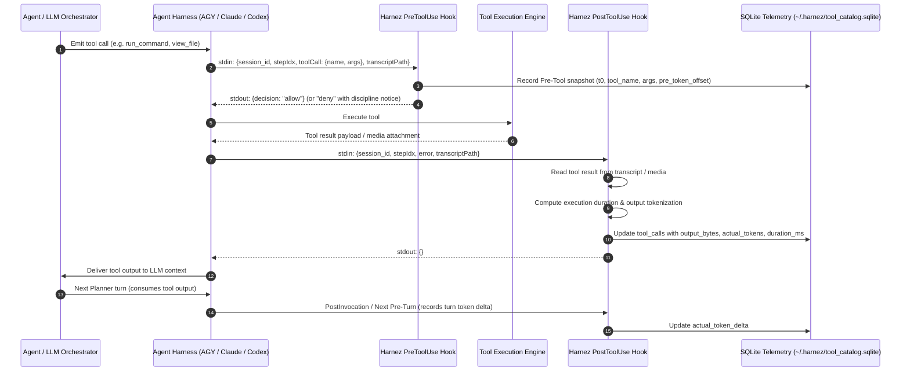
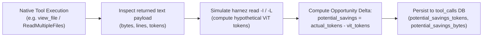

# Token Measurement and Lifecycle Hook Architecture

## 1. Overview & Motivation

Harnez uses client lifecycle hooks (in Antigravity/AGY, Claude Code, and Codex) to monitor, gate, and guide agent tool execution. Historically, lifecycle hooks operated purely as **`PreToolUse`** gates (e.g. `harnez hook agy` and `harnez guard`), which intercepted tool calls before execution to log metadata and enforce *Reading & Context Discipline* (Issue 405).

However, pre-execution gating alone cannot measure the **real token cost** of tool executions or determine the **empirical value** of multimodal tools like `harnez read -I` versus native agent tools like `view_file`.

This architecture establishes a closed-loop **Post-Tool & Token Measurement Pipeline** that:
1. Observes tool results immediately post-execution via `PostToolUse` / `PostInvocation`.
2. Correlates `(session_id, stepIdx)` across lifecycle steps.
3. Computes the **real token delta** ($\Delta \text{Tokens}$) billed by the upstream model.
4. Quantifies the **potential opportunity savings** of native tool executions versus Harnez-optimized alternatives.

---

## 2. End-to-End Lifecycle Architecture



---

## 3. Correlation & Step Tracking

To reliably attribute costs to a specific tool execution without race conditions or ambiguity across multi-turn sessions:

* **Primary Key**: `(conversationId / session_id, stepIdx)`
  * Antigravity / AGY explicitly emits `stepIdx` in both `PreToolUse` and `PostToolUse` payloads alongside `transcriptPath`.
  * Claude Code emits structured tool use IDs and turn indices.
* **Transient State Staging**:
  * In `PreToolUse`, a row is created in `tool_calls` with status `pending`, capturing timestamp $t_0$, `tool_name`, `args`, and baseline token/byte counters.
  * In `PostToolUse`, the matching row is retrieved and enriched with tool output metrics and execution latency $\Delta t = t_1 - t_0$.

---

## 4. Token Measurement Strategies

### Strategy A: Real Billed Turn Token Delta ($\Delta \text{Tokens}$)

The most accurate measure of what the agent paid for a tool call is the delta in cumulative prompt/input tokens between turns:

$$\Delta \text{InputTokens} = \text{SessionInput}_{\text{turn } N+1} - \text{SessionInput}_{\text{turn } N}$$

* **What it Captures**: The exact end-to-end context payload ingested by the model, including the tool output text/image tiles, prompt boilerplate, and any intermediate model reasoning tokens.
* **Source Signals**:
  * Claude Code: `usage.iterations` per-turn token arrays in session JSON.
  * AGY / Antigravity: Session token counters / transcript metadata.

### Strategy B: Deterministic Output Tokenization & ViT Math

When per-turn API counters are batched or asynchronous, Harnez computes the payload cost directly from the tool output recorded in `transcript.jsonl`:

* **Text Tools** (`view_file`, `cat`, `run_command` text):
  * The exact returned string payload is tokenized using provider-specific tokenizers (e.g. BPE / SentencePiece).
* **Multimodal Image Cards** (`harnez read -I`):
  * The generated PNG image dimensions are parsed.
  * Tile math is applied according to the active provider's vision pricing:
    * **Claude ViT**: $\lceil W / 512 \rceil \times \lceil H / 512 \rceil \times 1600 \text{ (scaled by aspect budget)}$
    * **OpenAI ViT**: $85 \text{ (base)} + 170 \times \text{tiles}$
    * **Gemini ViT**: Tile matrix token calculation

---

## 5. Potential Opportunity Savings for Native Tools

When agents bypass Harnez tools and invoke native IDE tools out of "tool declaration gravity", Harnez measures the **opportunity loss**:



This telemetry enables data-driven policy decisions:
* Identifying files and repositories where native reads consistently waste tokens.
* Justifying strict pre-tool hook redirects ([Issue 405](file:///home/uwe/projects/harnez/issues/405-implement-strict-pretooluse-hook-to-intercept-native-view-file-and-read-tool-calls-with-harnez-read.md)) based on empirical savings rather than heuristics.

---

## 6. Telemetry Schema & Storage

The `tool_calls` table in `~/.harnez/tool_catalog.sqlite` is extended to support closed-loop execution tracking:

```sql
ALTER TABLE tool_calls ADD COLUMN actual_tokens            INTEGER; -- Real measured input tokens for the tool payload / turn delta
ALTER TABLE tool_calls ADD COLUMN output_bytes             INTEGER; -- Raw byte size of the tool result
ALTER TABLE tool_calls ADD COLUMN potential_savings_tokens INTEGER; -- Hypothetical token savings if optimized tool was used
ALTER TABLE tool_calls ADD COLUMN potential_savings_bytes  INTEGER; -- Hypothetical byte savings
```

---

## 7. Reporting in `harnez stats`

`harnez stats` aggregates both measured and potential token metrics alongside call frequencies and failure rates:

`harnez stats --quality` runs the canonical telemetry data-quality checks
read-only; use `--json` for automation and `--strict` to return nonzero when a
check warns. The default quality mode reports warnings without failing.

```
TOOL                   CALLS  AVG SCORE  FAILURE RATE  AVG TOKENS  MEASURED SAVINGS  POTENTIAL SAVINGS
view_file               2204   5.00       0.0%         4,820       —                 1.42M tokens (68%)
harnez read -I           253   4.95       0.8%         1,210       320K tokens (72%) —
run_command             2597   5.00       0.0%           650       —                 —
```

This makes token optimization transparent, measurable, and auditable across all agent harnesses.
