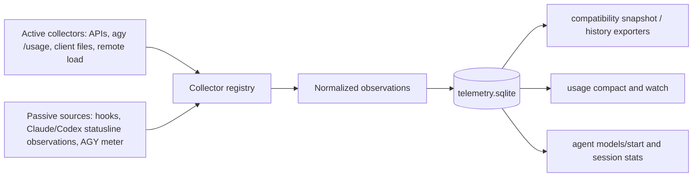

# Usage Collection Architecture

This is the migration design for `harnez usage` and Harnez-agent token accounting. It replaces
many reader-specific collection paths with one collection boundary and one queryable store, while
retaining compatible snapshots and archives until their consumers have moved.

## Goals and boundaries

- A single registry accepts active collectors and passive observations. Active collectors poll an
  upstream endpoint, a provider file, or a safe local command; passive sources (statuslines and
  hooks) push observations without starting a poll.
- A normalized quota reading records the provider, account/model pool, window, `used_fraction`
  (`REAL`, 0..1, never rounded), reset time, source identity, observation time, freshness, and
  optional raw payload version. A token reading similarly records cumulative or delta semantics,
  dimensions (input, cached input, output, reasoning), source, and observation time.
- SQLite at `$XDG_DATA_HOME/harnez/telemetry.sqlite` is the durable canonical store. It already
  has serialized, additive schema migrations and session/token tables; add tables rather than
  replacing its existing telemetry or breaking old exports. State snapshots remain a generated
  compatibility/read-performance mirror, not another authority.
- `usage --compact`, `--watch`, agent model/start quota checks, and agent-session statistics query
  the store API only. They do not directly call providers, parse provider files, or interpret cache
  files. An explicit refresh asks the registry to collect, then reads the same API.

## Status quo inventory

| Path | Writer; cadence | Readers / duplication |
| --- | --- | --- |
| `CollectClaude`, `CollectCodex`, `CollectAGY` | CLI, watch fallback, and collector; on demand or 15-minute daemon tick. Claude/Codex call provider APIs; AGY runs `agy -p /usage`; all also parse client files. | `CollectAll`, watch, compact. Each has bespoke normalization and may repeat a live fetch. |
| AGY meter/proxy (`~/.harnez/agymeter/`) | AGY proxy per call; passive/live meter readings. | AGY collector and stats; overlaps `agy -p /usage` quota windows and token estimates. |
| `$XDG_CACHE_HOME/harnez/quota-cache-{claude,codex,agy}.json` | Every provider collector after a live result; short freshness gate and flock. | Collectors and `CachedProviderQuotaAvailability` (agent models/start). Latest-only duplicate of snapshots. |
| `liveFetchCache` legacy provider-adjacent file | Compatibility migration/fallback path. | Provider collectors. It duplicates the XDG cache by design during migration. |
| `$XDG_STATE_HOME/harnez/agents/usage/<agent>.json` | `agent-collector` daemon (and once mode); 15-minute tick, atomic snapshots. | `CollectAll` cache-first fallback and watch. Duplicates latest quota/token state. |
| `$XDG_DATA_HOME/harnez/usage-history/quota-history.jsonl` and host history JSONL | Collector/cache refresh; append-only, throttled 15 minutes. | timeline/history/stats/export. Rounded integer percentages lose statusline precision. |
| `~/.harnez/agents/quota-readings.jsonl` | Harnez agent start/resume records before/after turn readings. | `stats --agents`; duplicates provider-cache reads and cannot retain richer source evidence. |
| Client usage files | Providers write Claude `stats-cache.json`, Codex rollout JSONL, AGY logs/conversation data. | provider collectors and project usage. These are sources, not Harnez stores. |
| Statuslines | Claude and Codex statusline commands render client/live information on refresh; statusline input can supply fractional limit percentages. | Presently display-only; its useful readings are lost rather than being a passive source. |
| `$XDG_DATA_HOME/harnez/telemetry.sqlite` (legacy `~/.harnez/tool_catalog.sqlite`) | Hooks, `harnez exec`, telemetry adapters; per event. | `stats`, export, session analytics. It stores tool calls, provider token snapshots, session boundaries and economics, but quota/history readers bypass it. |
| Remote load stream/snapshots | watch-side stream/remote fetch. | watch only; separate from quota collection and should join the registry as a non-provider collector. |

## Target flow

`Collector` has an ID, provider, capabilities, cadence/timeout policy and `Collect(ctx)`. A
`SourceSink.Observe(ctx, Observation)` accepts passive writes. The registry owns deduplication,
source priority, and freshness: a source never writes a rendered `AgentUsage` blob. Priority is
provider API or structured client event, then authenticated CLI command, then statusline, then
estimated/proxy data. Conflicting values are retained as observations; the query chooses the best
fresh value and exposes its provenance. Statusline observations must include the rendered-source
ID, received time, fractional value, and no secrets; they may update a window but never overwrite
a more authoritative simultaneous API observation.

The additive schema includes `usage_observations` (common provenance/payload), `quota_windows`
(observation FK, provider, pool, window key, `used_fraction REAL`, reset, freshness),
`turn_token_usage` (session/turn, delta or cumulative counter and nullable token dimensions with
per-dimension quality), `turn_quota_boundaries` (before/after capture metadata), and
`turn_quota_deltas` (paired observation IDs, fraction delta and both-side provenance). Index
provider/pool/window and observed time, plus session/turn. Keep `tool_calls`, existing provider
token snapshots and exports compatible; backfill them into these tables where their provenance
permits. SQLite is append-only for observations, with a compacted current-view query;
retention/export jobs archive only after parity and recovery are tested.

## Session and turn accounting

At agent-turn start, capture the store's best fresh quota view and insert a `turn_quota_boundaries`
row with source, freshness, cache age, cache availability and error details. At completion, ingest
provider token deltas and cumulative values into `turn_token_usage`, then record the second quota
observation. Pair only the same provider/pool/normalized window key when timestamps are ordered,
reset markers match, and used fraction did not decrease; preserve both observations' provenance
in `turn_quota_deltas`.
Preserve `measured`, `fitted`, `shared`, and `unknown` quality flags instead of manufacturing
precision. Existing `quota-readings.jsonl` is imported idempotently and retained as a recoverable
compatibility source; retire its writes only after row parity is checked and a backup is preserved.
This extends issue 603's quota check with durable evidence and lets `stats --agents` use the same
readings as `usage`.

## Migration milestones

1. **Store read seam (first):** add the registry/store API and compatibility importer; make
   `harnez usage --compact` read the store API, falling back to importing current snapshots/caches.
   Keep every writer; delete no data path.
2. **Collector registry:** move Claude, Codex, AGY, AGY meter and remote-load collection behind
   registered collectors with per-source cadence, cancellation and diagnostics. Retire direct
   `CollectAll` reader orchestration and its bespoke cache-first branches.
3. **Passive ingestion:** add hook/statusline ingestion and source precedence. Replace display-only
   statusline quota parsing and the AGY meter's direct reader path; retain provider formats only as
   adapters.
4. **Session attribution:** transact agent turn boundaries and token snapshots through the store;
   make `stats --agents`, `agent models`, and `agent start` consume its API. Stop
   `quota-readings.jsonl` writes only after importer parity and recovery backup are verified.
5. **Consolidation:** generate state snapshots and JSONL history from SQLite, migrate/export old
   data, then remove provider quota-cache and standalone history writers only after offline,
   recovery, and performance checks prove the store path. Archive legacy files rather than deleting
   them automatically.

The first milestone is deliberately narrow: it proves the new reader boundary through
`usage --compact` before changing live collection, protects existing schemas, and leaves a clean
rollback to imported compatibility records.

## Status and invariants (2026-09-30)

Milestones 1-5 shipped with tickets 650-655; 657 and 660 fixed regressions found only on live
output. Keep these invariants; each broke once:

- **Normalize window keys at write time, in every writer**, through the one shared normalizer
  (`five_hour`, `weekly`, ...). A one-shot migration is not enough: writers kept storing display
  labels ("Weekly (7-day)"), and compact silently lost Claude/Codex (657).
- **A quota window links only to an observation of its own provider.** The old
  `LastInsertId` upsert path cross-linked providers; the migration repairs this additively.
- **Compact projects the latest window per provider/pool/key**, excludes token counters
  (`tokens`) from quota rows, and sorts rows stably (Claude Code, OpenAI Codex, then AGY pools).
- **Never drop a provider silently.** A failed store projection or fetch renders an error row and
  logs to `~/.harnez/debug.log`; a hidden row looks exactly like missing data.
- **Views never block on collection or the store.** `usage --watch` draws a loading frame at once
  and fills quotas asynchronously; before 660 a blocking read delayed the first frame 14-19s and
  starved the `q` key. Statusline latency is open in 659.
- **Tests must not touch the real data path.** Store tests use an isolated DB; a test that wrote
  the live telemetry DB hung the suite for minutes (655).

- **Archive legacy files once, behind a guard.** A safety copy "before every mirror write" ran on
  each usage refresh and wrote 7,642 snapshots (166 GiB) in a week; it now skips once any
  archive has a `manifest.json` (`2f4f946e`). Any one-time migration step needs a marker check.

Legacy files are archived once under `~/.local/share/harnez/archive/usage-legacy/`, never
deleted automatically. The first archive holds the original files; later data lives in the store.

## Usage view modes (2026-10-02)

`spec/usage.yaml` is the source of truth for the usage presentation modes. It defines the `normal`,
`compact`, and `minimal` panel sets and display details, plus the default (`normal`). `normal` is a
plain table with one row per quota window (agent, quota, used, resets, tokens, tok/min, updated,
model, account); the per-agent detail boxes and the history totals were removed. All modes read the
usage store, so the table, `--compact` and `--minimal` show the same readings.
The JSON Schema and Go loader validate that contract; renderer code should consume the loaded mode instead
of maintaining parallel hardcoded mode defaults.

The view selector controls presentation. `--watch` controls the refresh loop and interaction only,
so one-shot and watch frames for a selected mode retain the same panels and detail. Keep layout
budgeting shared as well: title and status chrome, hidden-panel summaries, and overflow hints must
follow the selected mode, including when a terminal is too short to show every line. In particular,
reserve status-footer rows for static frames only when the live footer itself fits alongside the
header and body; otherwise one-shot and watch can disagree about whether panel content or the
overflow hint is visible.

Parity tests should exercise the no-flag default and each explicit mode, comparing one-shot and
watch output at ordinary and constrained terminal heights. Include the minimum heights where
footer reservation changes, since roomy-terminal tests will not expose clipping differences.

## Related work

This plan consolidates the architecture intent in issues 034, 085, 111, 113, 146, 152, 160, 161,
208, 255, 256, 404, 421, 445 and 446. UI-only work stays downstream of the store API; exports and
cost reporting extend the same schema rather than creating separate databases.
