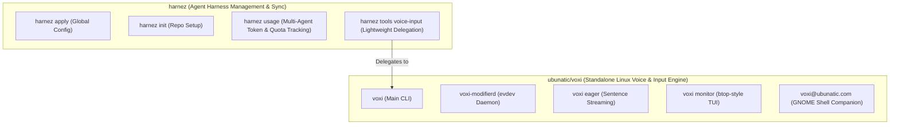

# ADR: Voice Input Extraction & Standalone Architecture (`voxi`)

- **Status**: Extracted / Standalone
- **Date**: 2026-08-18
- **Context**: [Issue 029 (Extract Standalone Voice Input Engine)](../issues/029-extract-ubunatic-voxi-standalone.md), [Issue 020](../issues/020-tools-command-os-tools.md), [Issue 021](../issues/021-fluent-streaming-typing.md), [Issue 022](../issues/022-gnome-transcriber-ui.md), [Issue 026](../issues/026-continuous-eager-sentence-streaming.md)
- **Primary Reference**: [`voxi` (ubunatic.com/voxi)](https://github.com/ubunatic/voxi)

---

## 1. Context & Architectural Separation

As analyzed in issue 029, the Linux voice input stack encompasses:
- Linux kernel evdev input drivers and root daemons (`voxi-modifierd`).
- Audio DSP pipelines and circular pre-roll buffers.
- GPU Vulkan hardware monitors and sysfs parsers.
- Wayland Mutter window focus coordinators and GNOME companion extensions.

To prevent domain drift, this entire subsystem was cleanly extracted into the standalone repository **`ubunatic/voxi`** (`voxi`).



## 2. Component Responsibility

| Repository | Scope & Domain | Binaries / Outputs |
|---|---|---|
| **`ubunatic/voxi`** | Audio capture, VAD segmentation, Whisper/Parakeet ASR, evdev modifier gating, synthetic typing injection, GNOME companion, btop TUI | `voxi`, `voxi-modifierd`, `voxi-eager.service`, `voxi-modifierd.service`, `voxi@ubunatic.com` GNOME extension |
| **`ubunatic/harnez`** | Claude Code / Prime Agent harness synchronization, AGENTS.md / docs bundling, unified token quota tracking | `harnez` |

---

## 3. Migration Guide

For systems with the previous `harnez-modifierd` or `harnez-voice-eager` services running, follow the migration steps:

```bash
# 1. Stop and disable legacy harnez services
sudo systemctl stop harnez-modifierd.service || true
sudo systemctl disable harnez-modifierd.service || true
systemctl --user stop harnez-voice-eager.service || true
systemctl --user disable harnez-voice-eager.service || true

# 2. Install and enable voxi services
cd ~/projects/voxi
make install
make install-user-services
sudo make install-modifierd

# 3. Clean up old binary symlinks if present
sudo rm -f /usr/local/bin/harnez-modifierd
rm -f ~/.config/systemd/user/harnez-voice-eager.service
```
