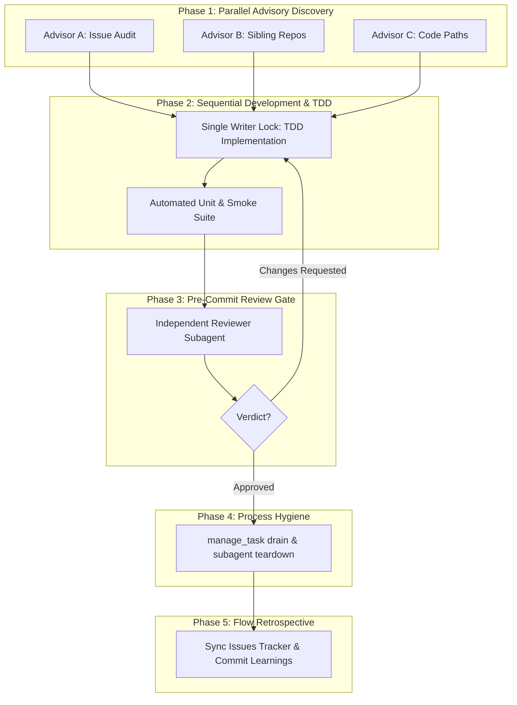

# The 5-Phase Agentic Sprint Loop & The Independent Review Gate

> **Who this is for** — practitioners orchestrating autonomous AI coding agents across multi-repository workspaces who want deterministic quality, zero drift, and clean teardowns.
>
> **Read this if** — your agents declare tasks "done" while leaving behind subtle regressions, orphan background processes, or messy context windows.\
> **Skip this if** — you only use AI for single-line autocomplete or single-file scripts.
>
> **Takeaways**
> 1. **Parallel Read, Sequential Write**: Concurrency is for discovery, auditing, and reviews. Only one agent holds the write lock on the workspace at any time.
> 2. **The Subagent Context Paradox**: Subagents save host tokens when isolating messy multi-file/multi-repo exploration, but cost initialization overhead on trivial fixes.
> 3. **The Independent Review Gate**: An independent reviewer subagent auditing git diff against acceptance criteria breaks the self-affirmation loop of single-agent workflows.
> 4. **The Zero Zombie Guarantee**: Lingering background tasks, watchers, and unmonitored subagents degrade test environments; clean teardowns must be an enforced phase of every sprint.

---

## 1. The Anatomy of Agentic Failure

When developers transition from prompting an AI for a single function to delegating entire features or bug investigations, three failure modes routinely emerge:

1. **The Context Ingestion Avalanche**:
   When asked to explore a problem spanning multiple files or repositories, a single agent unconstrainedly dumps entire file contents into its active conversation transcript. Within four turns, 40 KB of raw logs and template boilerplate choke the model's reasoning window. The agent loses track of edge cases and hallucinated details replace precise line numbers.

2. **The Rubber-Stamp Self-Review**:
   An agent that writes a bug is psychologically (probabilistically) predisposed to believe its solution works. When asked "Did you check your work?", it rereads its own reasoning, affirms its assumptions, and declares victory without executing meaningful test assertions.

3. **The Zombie Process Graveyard**:
   Autonomous workflows spawn background builds, test watchers, scheduled check timers, and child subagents. When a turn ends without explicit teardown, these background processes linger indefinitely, consuming file descriptors, holding socket locks, and causing subsequent test suites to fail cryptically.

To eliminate these failure modes without introducing bureaucratic frameworks or multi-thousand-line orchestration libraries, we codified the **5-Phase Agentic Sprint Loop**.

---

## 2. The 5-Phase Sprint Workflow



---

### Phase 1: Parallel Advisory Discovery (Concurrent Read-Only)

Before any file is touched or any line of code is written, discovery begins.

* **Mechanics**: The Host Orchestrator spawns concurrent, read-only advisor subagents—one per ticket or distinct subsystem.
* **Constraints**: Advisors have **zero write tools**. They explore code paths, inspect issue tickets, and survey sibling repositories.
* **The Context Shield**: Each advisor operates in an isolated context. When an advisor audits 27 sibling repositories for configuration drift, hundreds of directory reads and file peeks occur inside the subagent. Only a concise, 1 KB markdown summary returns to the host. The host’s working memory remains pristine.

> 🤖 **Agent takes the wheel** — scanning messy workspaces, finding files, and formulating concrete line-range plans across multiple repositories simultaneously.
>
> 🛡️ **The check that makes it safe** — read-only tool scoping. An advisor cannot create merge conflicts, clobber uncommitted changes, or mutate dependencies because write permissions are physically absent from its toolset.

---

### Phase 2: Sequential Development & TDD (Single Writer)

Once the plan is synthesized, execution moves to a strict single-threaded write phase.

* **Single Writer Lock**: Even if ten tickets were audited in Phase 1, only **one** agent modifies the workspace at any time. Parallel writes to the same repository produce file corruption, git conflicts, and race conditions on package managers (`go.mod`, `Cargo.lock`, `build.zig.zon`).
* **Test-Driven Verification**: Every milestone must be validated by automated unit tests (`go test -count=1 ./...`) and end-to-end smoke scripts (`scripts/smoke-test.sh`).
* **Zero-Token Reviewers**: Automated test assertions are the ultimate reviewer—they run in milliseconds, execute deterministically, and cost **0 LLM tokens**.

---

### Phase 3: Pre-Commit Review Gate (Independent Reviewer)

Before any change is committed to git or marked complete, it must pass an independent quality gate.

* **Why Separation Matters**: A developer agent that just spent 10 tool calls crafting an implementation has tunnel vision. An independent reviewer subagent spawned with only the problem statement, acceptance criteria, and `git diff` evaluates the code with fresh, unbiased attention.
* **Review Gate Checklist**:
  1. **Test Assertion Rigor**: Are assertions testing real behaviors, or are they empty executions?
  2. **Documentation & Tracker Sync**: Are issue statuses in `issues/*.md`, the index in `issues/README.md`, and system rules in `AGENTS.md` updated?
  3. **Zero-Feature-Bloat Invariant**: Did the fix stay minimal, or did it introduce unnecessary abstractions and runtime overhead?
  4. **Code Cleanliness**: Is the code token-efficient, idiomatic, and maintainable for future agents?

> 🤖 **Agent takes the wheel** — auditing the exact git diff against the ticket requirements without emotional attachment to the written code.
>
> 🛡️ **The check that makes it safe** — formal gating verdicts (`APPROVED` vs `CHANGES REQUESTED`). If the reviewer flags missing edge-case tests or doc discrepancies, the orchestrator reverts to Phase 2 to resolve them before proceeding.

---

### Phase 4: Process & Subagent Hygiene (Teardown & Drain)

When the code passes review, the orchestrator enforces hygiene before declaring the sprint over.

* **The Zero Zombie Guarantee**:
  - Inspect background tasks (`manage_task list`).
  - Explicitly kill completed, idle, or lingering background jobs, schedule timers, and watch loops.
  - Terminate all child subagents (`manage_subagents kill_all`).
* **Why This Is Critical**: Unmonitored background tasks accumulate file locks, exhaust memory, and silently intercept subsequent test runs. A clean environment is a prerequisite for the next sprint.

---

### Phase 5: Flow Quality Retrospective (Learning Capture)

The final phase commits knowledge into the repository itself.

* **Turn Ephemeral Chats into Git Artifacts**: If a developer and agent discuss tooling friction, bug root causes, or architectural lessons in chat, that knowledge is lost the moment the context window ends. Phase 5 persists these learnings to `docs/feedback/` or `docs/studies/`.
* **Tracker Reconciliation**: Update issue files (e.g. `Status: Closed`), synchronize `issues/README.md`, and run `harnez status` to verify zero tracker drift.

---

## 3. The Economics of Agentic Teams: Subagent vs. Inline

A frequent question in agentic engineering is: *When is the overhead of spawning a subagent worth the cost?*

### The Subagent Context Paradox

```
                       ┌────────────────────────┐
                       │  Host Agent Context    │
                       └───────────┬────────────┘
                                   │
              ┌────────────────────┴────────────────────┐
              ▼                                         ▼
   [Broad Exploration]                       [Direct Code Fix]
   (27 sibling repos, 100+ tools)            (1 doc edit, 2 lines)
              │                                         │
              ▼                                         ▼
   Spawn Subagent:                           Execute Inline:
   - 50 tool calls stay in subagent          - 2 tool calls in main context
   - 1 KB summary returns to Host            - 0 subagent spawn overhead
   ─────────────────────────────             ─────────────────────────────
   RESULT: Massive Token Saving              RESULT: Zero Redundant Prompting
```

* **When to Spawn Subagents**:
  - **High-Entropy Exploration**: Auditing multiple sibling repositories, analyzing raw transcript logs, or parsing massive documentation trees.
  - **Independent Review Gates**: Auditing complex diffs where human-level scrutiny is required to catch omissions.
* **When to Execute Inline**:
  - **Targeted Edits**: Minor documentation wording, single-function bug fixes, or running deterministic linters.

### The Quality Floor
Even for small changes, the overhead of a fast reviewer subagent is negligible (often < 2 seconds and minimal tokens for a focused diff), while providing a reliable quality floor that prevents trivial typos, broken markdown links, and missed issue tracker updates from slipping into `main`.

---

## 4. Field Report: The 27-Sibling Project Audit

During the initial deployment of the `/sprint` command in `harnez`, we tested this multi-phase workflow against a real-world scenario: auditing why recent `harnez` practice documents (such as `docs/practices/AgenticLoop.md`) had not propagated to 27 sibling repositories across the workspace.

1. **Phase 1 in Action**:
   An Exploration Advisor inspected all 27 projects (`cati`, `voxi`, `uman`, `goha`, `zterm`, `vkfusion`, etc.). It mapped every repository's language mix, build driver (Makefiles vs `build.zig` vs `Taskfile.yml`), and marker state. Doing this in the main agent would have exhausted the context window with file listings; in a subagent, it returned a pristine 1-page table.

2. **Phase 2 in Action**:
   Based on the audit, we drafted Issue 041 and implemented five table-driven test suites in `internal/claude/*_test.go`. When testing polyglot language auto-detection, the test suite immediately caught that `*.c` files were not detected under C/C++ rules—a bug fixed in 30 seconds with a 1-line update.

3. **Phase 3 & 4 in Action**:
   An independent reviewer audited the test suites for assertion rigor, confirmed the "Zero-Feature-Bloat" guarantee (proving the new tests were characterization safety nets requiring no heavy framework additions), and all subagents were cleanly terminated.

4. **Speech-to-Text Awareness**:
   The session also highlighted the human side of agentic pairing: when the user's voice transcription software produced *"Southern Exploration"* instead of *"Start an Exploration Agent"*, the workflow adapted cleanly, capturing phonetic awareness into `AGENTS.md` and `config.yaml` to make future agents robust against ASR homophones.

---

## 5. Summary Checklist for Agentic Sprints

```
[ ] Phase 1: Parallel Read-Only Advisors formulate plan without writing files.
[ ] Phase 2: Single-threaded TDD executes changes with passing automated assertions.
[ ] Phase 3: Independent Reviewer audits git diff against acceptance criteria.
[ ] Phase 4: Background tasks drained; subagents killed (Zero Zombie Guarantee).
[ ] Phase 5: Issue tracker synced; learnings committed to docs/studies/ or docs/feedback/.
```
