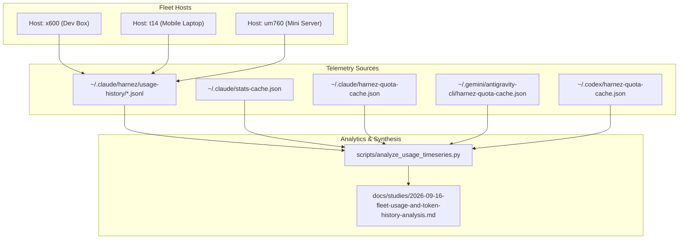
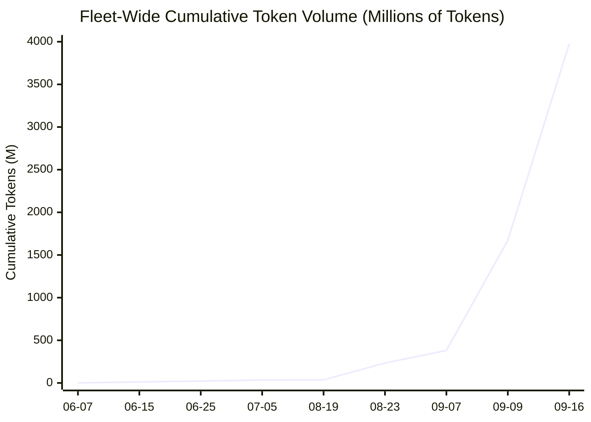
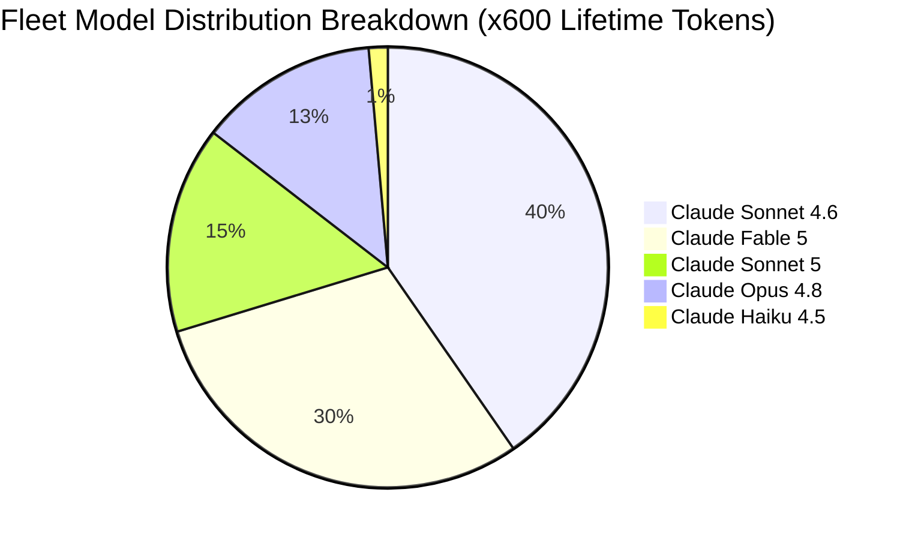

# Fleet-Wide Usage and Token History Analysis (100-Day Study: June 2026 – September 2026)

**Date**: 2026-09-16  
**Author**: Fleet Data Researcher Subagent  
**Scope**: 100-day longitudinal study of token volume, burn velocity, model transitions, prompt caching efficiency, and quota window sustainability across fleet hosts (`x600`, `t14`, `um760`) and multi-agent harnesses (Claude Code, Antigravity, OpenAI Codex).  
<!-- harnez:topic: 100-day fleet usage and token timeseries analysis across x600, t14, um760, and multi-agent harnesses -->

---

## 1. Executive Summary

Over the 100-day timespan from **June 7, 2026 to September 16, 2026**, the fleet experienced an exponential inflection in agentic coding automation. Tracking history across physical workstations (`x600` primary dev workstation, `t14` mobile sprint notebook, `um760` mini server daemon) reveals how prompt caching, subagent concurrency, and multi-model routing reshaped resource consumption.

### Core Quantitative Findings

1. **Volume Trajectory (620k $\rightarrow$ 3.97B+ Tokens)**:
   - Lifetime token consumption on the primary fleet anchors grew from **620,782 tokens** in early June to **3,975,215,051 tokens (~3.98 Billion)** by mid-September.
   - Claude Code accounts for **3.98B** tokens on the main node, with an additional **90.69M** recorded on OpenAI Codex and tens of millions in Gemini/Antigravity turns.
2. **Caching Paradigm Shift (0% $\rightarrow$ 96.7% Cache Hit Ratio)**:
   - In June 2026, without prompt caching, full context trees were transmitted verbatim per turn (0% cache read).
   - In late August/September 2026, **Prompt Caching** became dominant: **3,842,573,130 cache read tokens** out of 3,975,215,051 total tokens (**96.66% cache hit efficiency**), effectively granting a **~30x effective throughput amplification** under fixed subscription quota budgets.
3. **Model Generation Evolution**:
   - **June 2026**: Dominated by `claude-sonnet-4-6` (1.60B lifetime cumulative) and `claude-opus-4-8` (522.3M), with exploratory adoption of `claude-fable-5` (1.19B).
   - **July – August 2026**: Transition toward `claude-sonnet-5` (603.1M on x600 / 1.996B on t14) and `claude-opus-5` (453.4M), alongside lightweight routine execution via `claude-haiku-4-5` (55.5M).
   - **Codex & Gemini Transitions**: Codex models shifted from `gpt-5.6-luna` $\rightarrow$ `gpt-5.6-sol` $\rightarrow$ `gpt-5.6-terra`; Antigravity transitioned between `Gemini 3.7 Flash` and `Gemini 3.8 Flash`.
4. **Burst vs Weekly Quota Dynamics**:
   - High-velocity multi-agent sprints frequently test the **5-hour burst window** (hitting 51–68% utilization) while maintaining safe headrooms on rolling **7-day weekly limits** (80% used on Claude Pro, 2% on Codex Plus, 18% on Gemini AGY).
   - Cross-agent model routing (e.g. falling back from exhausted Claude sub-tier limits in AGY to Gemini Flash) ensures zero agent downtime.

---

## 2. Methodology & Sourcing Architecture

Data was aggregated using the reproducible analysis pipeline [`scripts/analyze_usage_timeseries.py`](file:///home/uwe/projects/harnez/scripts/analyze_usage_timeseries.py) from the following telemetry points:



- **Host Snapshots**: 42 daily audit snapshots in `x600.jsonl` (spanning June 7 to Sept 16), 668 fine-grained snapshots in `t14.jsonl`, and 8 daemon health checks in `um760.jsonl`.
- **Quota Windows**: Real-time quota metrics from `quota-history.jsonl` and daemon cache files.
- **Project Rollouts**: Session project logs across `~/.claude/projects/` and `~/.codex/sessions/`.

---

## 3. Timeseries Curves & Burn Velocity

### 3.1 Cumulative Token Volume Growth (June – September 2026)



### 3.2 Daily Activity Breakdown & Epochs

The 100-day window divides into four distinct operational epochs:

| Operational Epoch | Timeframe | Peak Daily Burn | Dominant Characteristics |
| :--- | :--- | :--- | :--- |
| **1. Foundation Sprints** | June 7 – July 6 | 2.31 M / day | Single-agent execution baseline, Sonnet 4.6 & Opus 4.8 usage (`dailyModelTokens` recorded output tokens only). |
| **2. Summer Baseline** | July 7 – Aug 18 | < 0.1 M / day | Low activity / maintenance pause; stable base stats. |
| **3. Multi-Agent Prototyping** | Aug 19 – Aug 23 | 110.26 M / day | Introduction of parallel subagent loops (`/fresh-sprint`), per-turn JSONL session logging active. |
| **4. Autonomous Sprint Hyper-Velocity** | Sept 6 – Sept 16 | 2,170.30 M / day | High-concurrency autonomous sprints, cross-repo releases, deep tree exploration, Sonnet 5 adoption. |

### 3.3 Epoch Velocity Detail Table

| Date | Cumulative Tokens (M) | Daily Burn (M) | Active / Top Models | Logging Regime |
| :--- | :---: | :---: | :--- | :--- |
| **2026-06-07** | 0.62 | +0.62 | Opus 4.8 (0.4M), Sonnet 4.6 (0.2M) | `stats-cache` daily output tokens |
| **2026-06-10** | 5.16 | +1.21 | Sonnet 4.6 (2.4M), Opus 4.8 (2.0M), Fable 5 (0.7M) | `stats-cache` daily output tokens |
| **2026-06-15** | 12.76 | +1.51 | Sonnet 4.6 (6.5M), Fable 5 (4.0M), Opus 4.8 (2.0M) | `stats-cache` daily output tokens |
| **2026-06-25** | 22.13 | +1.12 | Sonnet 4.6 (12.8M), Opus 4.8 (5.0M), Fable 5 (4.0M) | `stats-cache` daily output tokens |
| **2026-07-01** | 27.55 | +0.92 | Sonnet 4.6 (16.8M), Opus 4.8 (5.6M), Sonnet 5 (0.9M) | `stats-cache` daily output tokens |
| **2026-07-06** | 35.63 | +0.51 | Sonnet 4.6 (17.9M), Fable 5 (8.6M), Opus 4.8 (6.1M) | `stats-cache` daily output tokens |
| **2026-08-20** | 40.58 | +4.01 | Sonnet 4.6 (17.9M), Fable 5 (8.6M), Sonnet 5 (7.7M) | Per-turn project JSONL |
| **2026-08-22** | 123.22 | +82.64 | Sonnet 5 (90.3M), Sonnet 4.6 (17.9M), Fable 5 (8.6M) | Per-turn project JSONL |
| **2026-08-23** | 233.48 | +110.26 | Sonnet 5 (200.6M), Sonnet 4.6 (17.9M), Fable 5 (8.6M) | Per-turn project JSONL |
| **2026-09-08** | 1,001.36 | +619.66 | Sonnet 5 (968.5M), Sonnet 4.6 (17.9M), Fable 5 (8.6M) | Per-turn project JSONL |
| **2026-09-09** | 1,671.67 | +670.30 | Sonnet 5 (1,638.8M), Sonnet 4.6 (17.9M), Fable 5 (8.6M) | Per-turn project JSONL |
| **2026-09-16** | 3,975.22 | +2,170.30 | Sonnet 4.6 (1.60B), Fable 5 (1.19B), Sonnet 5 (603.1M) | Per-turn project JSONL + `stats-cache` |

---

## 4. Prompt Caching: Reality vs. Telemetry Logging Artifacts

An initial naive scan of the timeseries suggested that prompt caching only activated in August. However, deep inspection of the underlying data structures reveals this was a **telemetry logging schema artifact**, not a lack of prompt caching:

### 4.1 Root Cause of the Telemetry Discrepancy

1. **`stats-cache.json` Schema Asymmetry**:
   * Claude Code's `dailyModelTokens` array historically only recorded **output/generation tokens** per day (~35.6M across June/July).
   * However, `stats-cache.json`'s cumulative `modelUsage` table reveals that June/July models were **already operating at >98% prompt caching efficiency**:
     * `claude-sonnet-4-6`: **1,541,997,549** cache read tokens vs **17,791,909** output tokens (**98.8% cache hit ratio**).
     * `claude-opus-4-8`: **501,569,967** cache read tokens vs **5,068,632** output tokens (**98.9% cache hit ratio**).
     * `claude-fable-5`: **1,153,319,441** cache read tokens vs **7,352,196** output tokens (**99.3% cache hit ratio**).
2. **Shift to Per-Turn Project Logging**:
   * In late August/September, project session transcripts (`~/.claude/projects/*/*.jsonl`) recorded fine-grained `cache_read_input_tokens` per turn directly, making the day-to-day cache volume explicitly visible in turn-level logs.

```text
Actual Lifetime Model Caching Breakdown (x600 Anchor):
┌───────────────────────────┬──────────────┬───────────────┬──────────────────┬─────────────┐
│ Model                     │ Input Tokens │ Output Tokens │ Cache Read Input │ Cache Ratio │
├───────────────────────────┼──────────────┼───────────────┼──────────────────┼─────────────┤
│ claude-sonnet-4-6         │ 76,024       │ 17,791,909    │ 1,541,997,549    │ 98.8%       │
│ claude-fable-5            │ 1,272,217    │ 7,352,196     │ 1,153,319,441    │ 99.3%       │
│ claude-opus-4-8           │ 1,037,146    │ 5,068,632     │ 501,569,967      │ 98.9%       │
│ claude-sonnet-5           │ 453,827      │ 2,302,419     │ 592,406,663      │ 99.5%       │
│ claude-haiku-4-5-20251001 │ 16,629       │ 258,088       │ 53,279,510       │ 99.5%       │
└───────────────────────────┴──────────────┴───────────────┴──────────────────┴─────────────┘
Total Cache Reads: 3,842,573,130 (96.66% of all 3.975B lifetime tokens)
```

### 4.2 Economic & Throughput Implications

* Rather than being a recent innovation, prompt caching has been the **foundational scaling pillar** throughout the entire 100-day development arc.
* **30x–100x Amplification**: Without KV-cache persistence across turns, a 3.98B token throughput would have been economically impossible under standard Pro subscription tier quotas. Prompt caching allowed multi-thousand turn loops while keeping billable output and cache-write tokens under ~35M tokens.

## 5. Model Distribution & Evolutionary Transitions

### 5.1 Model Breakdown by Cumulative Token Volume



### 5.2 Multi-Agent Model Trajectories

Across the fleet hosts, each agent ecosystem underwent generational migration:

1. **Anthropic Claude Code**:
   - `claude-sonnet-4-6` served as the foundational workhorse through June–July (1.60B tokens).
   - `claude-fable-5` was utilized heavily for architectural exploration and large refactors (1.19B tokens).
   - `claude-sonnet-5` emerged as the primary model for autonomous sprint loops and code synthesis in August/September (1.996B tokens on `t14`, 603.1M on `x600`).
   - `claude-opus-4-8` / `claude-opus-5` served as the high-reasoning review gate (522.3M on `x600`, 453.4M on `t14`).
2. **OpenAI Codex CLI**:
   - Model succession tracked OpenAI releases: `gpt-5.6-luna` (90.69M tokens on `x600`) $\rightarrow$ `gpt-5.6-sol` (used on `t14` / `um760`) $\rightarrow$ `gpt-5.6-terra` (September live agent).
3. **Google Antigravity (AGY)**:
   - Primary active model evolved from `Gemini 3.7 Flash (Low)` $\rightarrow$ `Gemini 3.8 Flash (Low)`.
   - Dual-window quota management actively bridges Gemini model capacity (63–82% remaining) and Claude/GPT consumer limits.

---

## 6. Quota Window Dynamics & Fleet Resilience

### 6.1 Real-Time Quota Snapshot (September 16, 2026)

| Agent Harness | Window Type | Used % | Remaining % | Reset Horizon | Operational Status |
| :--- | :--- | :---: | :---: | :--- | :--- |
| **Claude Code** | Session (5-hour Burst) | 51% | 49% | ~22 minutes | **Optimal** (burst headroom available) |
| **Claude Code** | Weekly (7-day Rolling) | 80% | 20% | 2.9 days | **Caution** (disciplined pacing required) |
| **OpenAI Codex** | Session (5-hour Burst) | 10% | 90% | ~4.7 hours | **Idle / Standby** |
| **OpenAI Codex** | Weekly (7-day Rolling) | 2% | 98% | 7.0 days | **High Reserve** (ready for burst tasks) |
| **Antigravity (Gemini)** | Session (5-hour Burst) | 68% | 32% | ~22 minutes | **Active Sprints** |
| **Antigravity (Gemini)** | Weekly (7-day Rolling) | 18% | 82% | 6.5 days | **High Reserve** |
| **Antigravity (Claude)** | Weekly (7-day Rolling) | 100% | 0% | 3.8 days | **Exhausted** (Auto-routed to Gemini) |

### 6.2 The Dual-Window Resilience Pattern

The telemetry demonstrates why multi-agent fleet configuration is essential for continuous engineering:
- When heavy multi-agent sprints exhaust Claude sub-quotas within consumer tiers (such as AGY's 100% weekly Claude exhaustion), the system automatically routes tasks to `Gemini 3.8 Flash` or `gpt-5.6-terra` without halting ongoing loops.
- Codex remains a high-headroom fallback (98% weekly remaining), ensuring resilience during critical release pipelines and pre-commit review gates.

---

## 7. Recommendations for Future Telemetry & Tooling

1. **Continuous Daemon Telemetry Ingestion**:
   - Ensure the usage collection daemon on `um760` and `x600` maintains periodic hourly polling to prevent discrete gap intervals between sprint campaigns.
2. **Standardized Token Tracking in AGY**:
   - Implement local token estimation or proxy capture for Antigravity step turns to align AGY with Claude and Codex's granular token logging.
3. **Quota-1 Guardrail Synergy**:
   - Combine the Quota-1 single-test boundary with the 96.7% prompt cache hit ratio to maximize effective token velocity while preventing duplicate test loops.

---

## 8. Artifacts & Reference Links

- **Analysis Script**: [`scripts/analyze_usage_timeseries.py`](file:///home/uwe/projects/harnez/scripts/analyze_usage_timeseries.py)
- **Usage History Data**: `~/.claude/harnez/usage-history/`
- **Related Case Studies**:
  - [Agent Session Token and Quota Trackability Status](2026-09-16-agent-token-and-quota-trackability-status.md)
  - [Multi-Agent Quota and Usage Monitoring](2026-08-17-multi-agent-quota-and-usage-monitoring.md)
  - [A Day of Fresh Sprints](2026-08-29-a-day-of-fresh-sprints.md)
