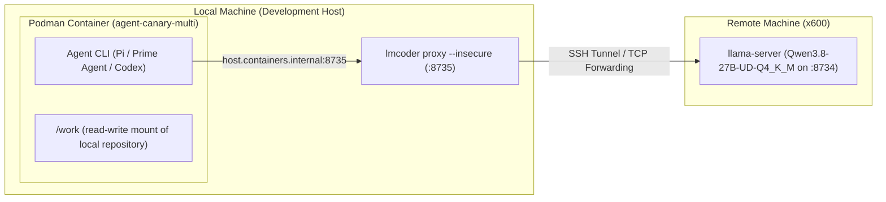

# Multi-Agent Issue Specification Benchmarking & Remote Inference Architecture

**Date**: 2026-09-17  
**Category**: Empirical Study / Multi-Agent Systems & Tooling  
**Target Repositories**: `harnez`, `lmcoder`  
**Related**: [[017-bake-agent-clis-into-build-container]], [[022-lmcoder-llm-api-proxy]], [[055-harnez-baked-workspaces-and-dependency-free-tui-sync-canary]], [[385-tokens-command-to-count-tokens-in-files-and-directories]], `docs/AgenticLoop.md`

---

## 1. Executive Summary

This study documents a comparative empirical experiment conducted to evaluate three distinct agentic operating modes for authoring a production feature specification (`harnez tokens <dirs...>|<files...> [--include|-I <pattern.ext>]`):

1. **Direct Remote LLM Prompting (`lmcoder prompt`)**: Stateless, zero-context one-shot completion against `qwen3.8-27b-instruct-q4` on host `x600`.
2. **Autonomous Container Agent (`lmcoder agent` / Pi CLI)**: Stateful, sandboxed Podman execution on the local host with HTTP reverse-proxying to remote GPU inference on `x600`.
3. **First-Principles Subagent (`self` subagent)**: Local tool-equipped subagent with active symbol lookup, inspecting codebase architecture and sibling commands.

The experiment revealed clear behavioral distinctions between pure language model generation, tool-guided containerized autonomous agents, and codebase-grounded subagents. It also yielded critical operational improvements for `lmcoder` container image builds and Go workspace isolation.

---

## 2. Architecture: Hybrid Local Sandbox with Remote GPU Inference

The execution topology combined local container sandboxing with high-throughput remote LLM inference across two physical machines:



### Key Architectural Invariants
1. **Security & Sandboxing**: Podman runs `--read-only --cap-drop=all --security-opt no-new-privileges --userns=keep-id`, mounting only the active project at `/work:rw,Z`.
2. **Network Bridge**: `lmcoder proxy` binds off-loopback (`0.0.0.0:8735`) so the container reaches `host.containers.internal:8735`, transparently routing OpenAI-compatible requests to `llama-server` on `x600:8734`.
3. **Tool Isolation**: The container bakes in full toolchains (`git`, `rtk`, `harnez`, Node, Python venv, and Go), isolating dependency compilation from the developer's root environment.

---

## 3. Comparative Benchmark: Three Modes of Issue Specification

### Specification Comparison Matrix

| Dimension | Tier 1: Direct Prompt (`lmcoder prompt`) | Tier 2: Sandboxed Agent (`lmcoder agent` / Pi) | Tier 3: Fresh Subagent (`self` subagent) |
| :--- | :--- | :--- | :--- |
| **Model / Host** | Qwen 27B on `x600` | Qwen 27B on `x600` (via Pi CLI) | Antigravity Subagent (Local) |
| **Context Access** | Zero repository context (stateless) | `AGENTS.md`, `docs/`, shell/Git tools | Active AST/Grep/File reading tools |
| **Autonomy Level** | Text output only (manual filing) | Complete E2E issue lifecycle & commit | Complete E2E issue lifecycle & commit |
| **Ticket Size / Density** | 217 lines (~5.9 KB) — Verbose | 72 lines (~3.0 KB) — Concise | 53 lines (~3.7 KB) — Dense & Structured |
| **Codebase Grounding** | Generic (assumed Python examples) | High (cited `docs/lang/Go.md`, linked #023/#034/#377) | Exact (cited `internal/assess.EstimateTokens`, `CountLines`) |
| **CLI Conventions** | Invented custom exit codes (`0,1,2`) | Added `--summary`, `--json`, NUL sniffing | Added `-d/--dir`, `--json`, `-s`, `.` default fallback |
| **Execution Latency** | ~35 seconds | ~6 minutes (multi-step tool iterations) | ~40 seconds (targeted subagent execution) |

### Findings & Qualitative Takeaways

1. **Zero-Shot Reasoning vs Repository Grounding**:
   - Without repository context, the 27B model demonstrated strong general engineering reasoning (e.g. proactively declaring Non-Goals, designing glob OR semantics).
   - However, it defaulted to generic assumptions (Python paths `src/app.py`, POSIX exit code schemes) rather than codebase-specific patterns.

2. **Tool-Driven Autonomy in Container Sandboxes**:
   - When equipped with the Pi CLI inside `agent-canary-multi`, Qwen 27B read `AGENTS.md`, queried the issue tracker via `harnez find issues next`, generated the ticket, updated `issues/README.md` via `harnez index`, and executed a clean conventional commit.
   - It integrated repository rules: cited the `docs/lang/Go.md` rule against external tokenizer dependencies and proposed NUL-byte sniffing for binary file detection.

3. **AST & Architectural Precision**:
   - The native subagent with direct code search identified that `harnez assess` already performs heavy repo-wide scans and positioned `harnez tokens` as its targeted lightweight counterpart, directly linking internal helper functions (`EstimateTokens`, `CountLines`).

---

## 4. Container Toolchain & Build Hardening

During container validation, two critical infrastructure issues were diagnosed and resolved:

### 4.1 Debian Distro Go Toolchain Stagnation
- **Problem**: `node:22-slim` installed `golang-go` from Debian repositories, which was stuck at Go 1.19. Building modern Go projects failed due to `invalid go version` in `go.work` / `go.mod`.
- **Solution**: Upgraded [`scripts/agent-canaries/multi/Containerfile`](file:///home/uwe/projects/lmcoder/scripts/agent-canaries/multi/Containerfile) to use multi-stage copying:
  ```dockerfile
  COPY --from=golang:1.24 /usr/local/go /usr/local/go
  ENV PATH="/usr/local/go/bin:${PATH}"
  ```
- **Verification**: Verified compilation of `harnez` 0.1.14 directly inside the container sandbox.

### 4.2 Go Workspace (`go.work`) Boundary Handling
- **Observation**: When a repository contains a local `go.work` pointing to sibling directories (e.g. `../voxi`), mounting only the single target repository into `/work` causes `go build` to fail when looking for `/voxi`.
- **Remedy**: Sandboxed builds targeting isolated repositories must set `GOWORK=off` or ensure sibling paths are mounted if multi-module development is required.

---

## 5. Agentic Loop Invariants & Process Hygiene

1. **Reactive Wakeup vs Schedule Timers**:
   - Invoking redundant one-shot `schedule` timers while long-running background tasks or container builds are executing creates unnecessary turn interrupts.
   - Agents should rely on native system notifications (`MESSAGE_PRIORITY_HIGH` background task completion wakeups) rather than polling timers.
2. **Zero Zombie Guarantee**:
   - All background tasks and subagents were tracked and cleanly completed without orphaned processes.
