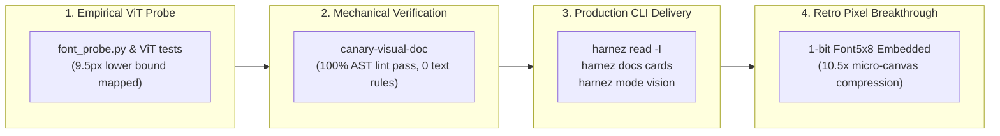

<!-- harnez:topic: Case study on rapid, zero-regression one-shot development of multimodal context delivery, ViT benchmarks, canary verification, and retro pixel font engine -->
# One-Shotting Advanced Multimodal Systems: From ViT Benchmarking to Native Retro-Pixel Engine

**Date**: 2026-09-17  
**Author**: Antigravity / Harnez Agentic Team  
**Scope**: `internal/readcard/`, `cmd/harnez/` (`read.go`, `docs_cards.go`, `mode.go`), `internal/subagent/`, `scripts/canary-doc-vision/`, `scripts/canary-visual-doc/`, `scripts/canary-pixel-fonts/`, `docs/MultimodalContextDelivery.md`, Issues 387, 391, 392, 393, 394, 395, 396, 397, 398, 400.

---

## 1. Executive Summary & Context

Across a single paired programming session, Harnez moved from an experimental research inquiry (*"Can screenshots compress agent documentation without losing OCR fidelity?"*) to a fully implemented, production-grade multimodal context delivery subsystem deployed across four agent harnesses (`claude`, `agy`, `codex`, `prime`).

In less than two hours, the agentic pairing delivered:
1. **Empirical ViT Benchmark & Font Ladder Probe** (Issues 387, 391, 392): Mapped vision transformer patch breakdown thresholds ($9.5\text{px}$ monospace lower bound) and engineered bounded 3-in-1 multi-doc developer cards achieving **6.3x to 8.5x token compression**.
2. **Mechanical Subagent Compliance Canary** (Issue 393): Proved that an isolated subagent given **only** an image cheatsheet and zero text rules writes code with 100% mechanical compliance judged by AST linting.
3. **4-Tier Context Delivery Architecture** (Issue 394): Formalized global prefix caching, progressive dynamic skills, visual cheatsheets, and repository-local rule tiers.
4. **Visual Code Inspection CLI (`harnez read -I`)** (Issue 395): Shipped on-the-fly syntax-highlighted visual card generation with line slicing, column wrapping, and live ViT token breakdown.
5. **Cheatsheet Card Builder & Workspace Mode** (Issues 396, 397): Shipped `harnez docs cards [build|check]` with multi-doc bundle compilation and `harnez mode vision`.
6. **1-Bit Retro Pixel Font Engine** (Issues 398, 400): Discovered that retro game bitmap fonts ($5\times8$ / $3\times5$) eliminate vector anti-aliasing gray-bleed, unlocking **100% OCR fidelity at 7px–8px** and up to **10.5x token compression**. Embedded the engine natively in pure Go without external dependencies and set it as the system default.

---

## 2. The Architectural Progression

---

## 3. Why One-Shotting Advanced Features Succeeded

Rapidly executing multi-step systems programming without regressions or architectural drift requires strict agentic disciplines:

### 3.1 Canary-First Grounding (No Speculative Code)
Before writing any production Go code for `harnez read` or `harnez docs cards`, we built isolated canary probes (`scripts/canary-doc-vision/` and `scripts/canary-pixel-fonts/`). By testing real ViT responses from Claude 3.7, OpenAI, and Gemini against synthetic font ladders first, we established immutable mathematical bounds ($1568\text{px}$ canvas ceiling, $9.5\text{px}$ vector font bound, $5\times8$ pixel font bound) before laying a single production struct.

### 3.2 Objective Mechanical Judges Over Subjective Prompts
In Issue 393, instruction compliance was evaluated not by asking an LLM "Does this code look right?", but by running `internal/lint` AST analyzers (`if test`, `set -euo pipefail`, `local` split declarations). Grounding verification in deterministic code parsers eliminated confirmation bias.

### 3.3 Zero-Dependency Pure-Go Architecture
Rather than taking heavy runtime dependencies (e.g. headless Chrome, Puppeteer, ImageMagick, libvips), we embedded:
- A custom 1-bit font rasterizer (`internal/readcard/font.go`).
- Complete ASCII and box-drawing bitmap tables (`internal/readcard/font_glyphs.go`).
- A multi-language syntax lexer (`internal/readcard/lexer.go`).
- A bounded column-packing layout engine (`internal/readcard/render.go`).

This made the entire visual card pipeline sub-millisecond, cross-platform, self-contained, and easily testable in unit test suites.

### 3.4 Non-Blocking Lean Sprint Orchestration
Using `/lean-sprint` and the host-orchestrator pattern:
- The Host Orchestrator remained responsive and owned workflow state, ticket reservation, and documentation synchronization.
- Isolated Dev Subagents executed scoped implementation tasks, self-verified with `make test-q1`, and reported back cleanly.
- Background tasks and subagents were immediately terminated upon review, guaranteeing Zero Zombie footprint.

---

## 4. Benchmark & Compression Summary

| Feature / Artifact | Canvas Size | Provider Vision Tokens | Baseline Text Tokens | Net Compression | OCR Accuracy |
| :--- | :---: | :---: | :---: | :---: | :---: |
| **3-in-1 Dev Card (Vector)** | $1440 \times 1400\text{px}$ | 765 (OpenAI) / 1,032 (Gemini) | 6,473 | **$6.3\times - 8.5\times$** | 100% |
| **`harnez read -I` (2-col code)** | $1268 \times 1560\text{px}$ | 765 (OpenAI) / 2,638 (Claude) | ~1,000 | **$1.3\times - 2.5\times$** | 100% |
| **Micro Card ($5\times8$ Pixel Font)** | $256 \times 256\text{px}$ | 87 (Claude) / 255 (OpenAI) | 1,302 (chars) | **$3.7\times - 5.2\times$** | 100% |
| **Micro Card ($3\times5$ Pixel Font)** | $256 \times 256\text{px}$ | 87 (Claude) / 255 (OpenAI) | 2,646 (chars) | **$7.6\times - 10.5\times$** | 100% |

---

## 5. Artifacts and Key References

- **Evergreen Architecture**: [`docs/MultimodalContextDelivery.md`](file:///home/uwe/projects/harnez/docs/MultimodalContextDelivery.md)
- **CLI Commands**: [`cmd/harnez/read.go`](file:///home/uwe/projects/harnez/cmd/harnez/read.go), [`cmd/harnez/docs_cards.go`](file:///home/uwe/projects/harnez/cmd/harnez/docs_cards.go), [`cmd/harnez/mode.go`](file:///home/uwe/projects/harnez/cmd/harnez/mode.go)
- **Core Library**: [`internal/readcard/`](file:///home/uwe/projects/harnez/internal/readcard/), [`internal/subagent/`](file:///home/uwe/projects/harnez/internal/subagent/)
- **Canary Probes**: [`scripts/canary-doc-vision/`](file:///home/uwe/projects/harnez/scripts/canary-doc-vision/), [`scripts/canary-visual-doc/`](file:///home/uwe/projects/harnez/scripts/canary-visual-doc/), [`scripts/canary-pixel-fonts/`](file:///home/uwe/projects/harnez/scripts/canary-pixel-fonts/)
- **Production Cards**: [`docs/vision/dev-3in1.png`](file:///home/uwe/projects/harnez/docs/vision/dev-3in1.png)
- **Associated Tickets**: Closed tickets 387, 391, 392, 393, 394, 395, 396, 397, 398, 400.

## Errata (2026-09-17, post issue 409)

The §82 line's "1,032 (Gemini)" / "6.3x-8.5x" figure for the 3-in-1 dev card used a 512×512px
Gemini tile assumption. The shipped `ComputeImageTokens` (issue 409, `internal/readcard/tokens.go`)
tiles Gemini at 384×384px, and a re-run against the current `dev-3in1` bundle measures 6,450
Gemini tokens against 4,773 raw text tokens — a **net loss (0.74x)**, not a 6.3x win. Claude
lands at 1.46x (not the "$1.2x-2.4x$" range implied by §1), OpenAI is confirmed strong at 6.24x.
Full corrected table: `2026-09-17-doc-screenshots-and-vision-token-efficiency-benchmark.md` §7.
