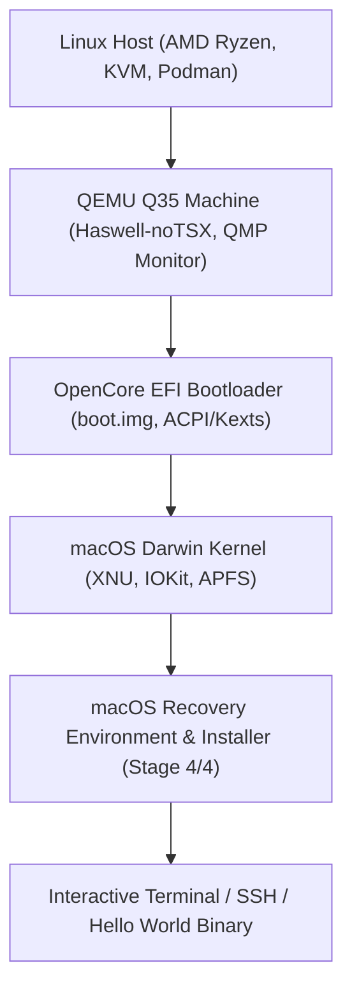
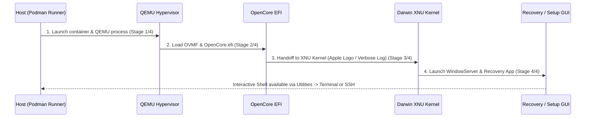

# macOS Containers on AMD KVM & Podman: Architecture, Quirks, and Diagnostic Guide

Case study and empirical reference guide for virtualizing and containerizing macOS (macOS 11 Big Sur through macOS 14 Sonoma) on Linux x86_64 host kernels using KVM, Podman, QEMU, and OpenCore on AMD Ryzen processors.

---

## 1. Overview & Virtualization Architecture

Virtualizing macOS within standard rootless/rootful Linux containers (`dockur/macos` or custom QEMU/KVM wrappers) involves orchestrating four distinct layers:



### Key Hardware Boundaries & Ports
* **Web UI (noVNC)**: `http://localhost:8006` (VNC over WebSockets with custom cursor styling)
* **Native VNC**: `localhost:5900`
* **SSH Forwarding**: `ssh -p 2222 localhost` (Guest port 22 mapped to host port 2222)
* **QMP Monitor**: `/dev/shm/monitor.sock` (UNIX domain socket inside container for CPU/register/memory inspection)
* **VirtFS / Shared Dir**: Host repo mounted at `/shared` inside the guest

---

## 2. Empirical Quirks on AMD Ryzen & Fix Matrix

Virtualizing macOS on AMD Ryzen introduces specific x86 virtualization and kernel quirks that do not occur on Intel VT-x hosts:

| Subsystem / Quirk | Symptom in macOS Guest | Root Cause | Fix / Mitigation |
| :--- | :--- | :--- | :--- |
| **64-bit PCI MMIO Hole** | `PHYSMAP_PTOV bounds exceeded` panic during memory bootstrap | QEMU default `pci-hole64-size` places PCI MMIO space above XNU's direct physical map limit | Pass `-global q35-pcihost.pci-hole64-size=0` in QEMU `ARGS` |
| **Intel CPUID Spoofing** | Immediate boot hang / kernel panic on CPU topology probe | XNU expects GenuineIntel MSRs, TSC invariants, and specific instruction subsets | Pass `-cpu Haswell-noTSX,vendor=GenuineIntel,+invtsc,vmware-cpuid-freq=on` |
| **Haswell Pre-C0 Stepping** | `"Haswell pre-C0 steppings are not supported"` at `machine_check.c:96` | QEMU's default Haswell stepping is `stepping=1` (pre-C0), rejected by XNU | Set `stepping=3` or `stepping=4` on QEMU CPU model |
| **Early PRNG Trap (SurPlus)** | Kernel trap at early boot (`_early_random` / PRNG init) | Big Sur 11.3+ introduced strict RDRAND/RDSEED expectations in `read_erandom` | Enable OpenCore SurPlus patches (`read_erandom` & `register_and_init_prng`) |
| **IOMapper / AppleVTD** | Page fault at `0x40` / NULL dereference in `IOPMrootDomain` | AppleVTD tries to initialize non-existent Intel VT-d DMAR tables on AMD KVM | Enable `DisableIoMapper: true` in OpenCore `Kernel->Quirks` |
| **Early Serial Diagnostics** | Silent halts with no serial log output | OpenCore release kernel suppresses early panic dumps to UART0 | Enable `Patch 5` (panic string to serial), `Patch 6` (early prints), and add `serial=3 debug=0x100` |
| **EFI NVRAM Target Crash** | QEMU hangs when OpenCore writes NVRAM log to read-only disk | OpenCore attempts filesystem write to read-only virtual floppy/EFI disk | Set `Target: 0` under OpenCore `Misc->Debug` |
| **Screen Auto-Cropping** | Huge solid black borders on screenshot dumps | QEMU framebuffers allocate 1920x1080/1280x720 while guest renders centered native viewport | Apply pure-Go luminance bounding box detection with 16px padding |

---

## 3. The 4-Stage Boot Progression Model

Monitoring the boot sequence is categorized into four observable phases:



1. **Stage 1/4 (Hypervisor Init)**: Podman starts container, QEMU maps memory and attaches tap networking and storage disks.
2. **Stage 2/4 (Bootloader Init)**: OVMF firmware loads `OpenCore.efi`, parses `config.plist`, applies kernel patches, and presents boot picker or direct boots `macOS Base System`.
3. **Stage 3/4 (Kernel Active)**: OpenCore jumps to `boot.efi` and transfers execution to the Darwin XNU kernel (`HANDOFF TO XNU`). Verbose logs stream to serial and screen.
4. **Stage 4/4 (Interactive System)**: `launchd` initializes `WindowServer`, loads macOS Recovery GUI, and opens SSH daemon on port 22.

---

## 4. Diagnostic & Deep Inspection Toolkit

Our CLI runner (`scripts/macos-podman/main.go`) provides built-in deep inspection tools via QMP monitor socket:

* **Boot Status**: `go run ./scripts/macos-podman boot-status [-s]`
  * Queries HTTP, VNC, SSH, QEMU CPU thread state, serial logs, and captures auto-cropped guest screenshots.
* **Deep Register & Stack Inspection**: `go run ./scripts/macos-podman inspect`
  * Reads RIP, RSP, CR0, CR2 (Page Fault Address), CR3 (Page Table Base), and CPL (Ring 0 supervisor vs Ring 3 user).
  * Disassembles active machine instructions at `$rip`.
  * Dumps stack slots at `$rsp` and traverses trap call frames to pinpoint faulting C++/Mach functions in XNU.

---

## 5. Execution of Go Darwin Binaries in Recovery GUI

Once Stage 4/4 is active:
1. Open the Web UI at `http://localhost:8006` (or VNC `localhost:5900`).
2. Select your preferred language (e.g. English) in the **Language Chooser** dialog and click the arrow.
3. In the top macOS menu bar, open **Utilities &rarr; Terminal**.
4. The host repository is mounted via VirtFS 9p at `/shared` (or accessible via network/storage).
5. Execute cross-compiled Darwin binaries directly:
   ```bash
   /shared/scripts/macos-hello/hello_darwin_amd64
   ```

---

## 6. Full macOS Installation onto Persistent Storage (`data.img`)

To have a fully installed, real macOS operating system with persistent user accounts, daemons, and SSH access:

### Step 1: Initialize Virtual Disk
In the Recovery GUI (**[http://localhost:8006](http://localhost:8006)**):
1. Launch **Disk Utility** from the macOS Utilities window (or run `diskutil eraseDisk APFS "Macintosh HD" GPT /dev/disk0` in Terminal).
2. Select the uninitialized QEMU drive (64 GB).
3. Click **Erase**:
   * **Name**: `Macintosh HD`
   * **Format**: `APFS`
   * **Scheme**: `GUID Partition Map`
4. Quit Disk Utility.

### Step 2: Trigger macOS Installation
1. Select **Reinstall macOS Big Sur** &rarr; **Continue**.
2. Accept the software license agreement.
3. Select **Macintosh HD** as the destination disk and click **Install**.
4. The installer will download components from Apple and install the OS onto `./macos-storage/11/data.img`.

### Step 3: Persistent Boot
* Because `./macos-storage` is mapped persistently to `/storage` on the host, all installed OS files and state are saved in `./macos-storage/11/data.img`.
* Subsequent boots will automatically detect the installed system and boot straight into the full macOS environment without passing through Recovery.

### Recovery UI Lifecycle & Springboard Focus Quirk
* **Windowless Process State**: In macOS, closing an app's window (via `exit` or `Cmd+W`) leaves the process running in the background while holding top menu bar focus (e.g. `Terminal`, `Shell`, `Edit`).
* **Springboard Suppression**: In Recovery mode (where no Dock or App Switcher exists), the main 4-option launcher (`OSIESpringboard`) remains hidden as long as any utility process is active.
* **Resolution**: Terminate the windowless process using `Cmd+Q` (or `Windows+Q` on non-Apple keyboards, or `killall <AppName>`). `OSIESpringboard` immediately unhides the main recovery launcher.

---

## 7. Programmatic Terminal Steering via QEMU QMP

To enable headless automation and continuous testing without manual browser interaction, our runner communicates over the UNIX domain socket `/dev/shm/monitor.sock` inside the container:

### CLI Subcommands
```bash
# 1. Type raw text or shell commands into guest terminal
go run ./scripts/macos-podman type "uname -a\n"

# 2. Execute cross-compiled Darwin binaries mounted from host
go run ./scripts/macos-podman type "/shared/scripts/macos-hello/hello_darwin_amd64\n"

# 3. Send navigation / control keys (ret, spc, tab, ctrl-c)
go run ./scripts/macos-podman send-key ret

# 4. Automate one-shot APFS partition creation in Recovery
go run ./scripts/macos-podman install-os
```

### Key Encoding Architecture
QEMU monitor requires translating UTF-8 characters and control codes into internal QEMU key event descriptors:
* Uppercase characters (`A-Z`) &rarr; `shift-<a>`
* Punctuation symbols (`_`, `:`, `"`, `+`, `$`, `/`) &rarr; mapped to explicit `shift-minus`, `shift-semicolon`, `shift-apostrophe`, etc.
* Spacing and lines (`\n`, ` `) &rarr; `ret`, `spc`
* Inter-keystroke spacing (30 ms) ensures the guest macOS HID event queue does not drop fast-burst scancodes.

---

## 8. Verified Milestone: Persistent Full macOS Desktop

As of 2026-09-14:
* Full macOS Big Sur (11) operating system is fully installed and sealed onto `./macos-storage/11/data.img`.
* CPU execution runs stably in Ring 3 (`CPL=3`) userland mode on AMD Ryzen with KVM acceleration.
* Persistent environment is ready for local cross-platform development, continuous testing of Go Darwin binaries, and headless automation.

---

## 9. Remote Execution & Migration to Dedicated Nodes (e.g. `x600`)

The containerized macOS environment can be migrated and executed seamlessly on remote Linux compute nodes (e.g. `x600` featuring AMD Ryzen 7 8700G, 16 vCPUs, 45 GiB RAM, 338 GiB NVMe, and KVM):

### One-Command Sparse Replication
```bash
# Sync local persistent storage to x600 (sparse mode preserves unallocated disk space)
go run ./scripts/macos-podman sync x600
```

### Remote Headless Orchestration
```bash
# Start macOS container on remote host x600
go run ./scripts/macos-podman --host x600 run

# Monitor boot & capture screenshots remotely
go run ./scripts/macos-podman --host x600 boot-status

# Inspect CPU & memory remotely
go run ./scripts/macos-podman --host x600 inspect
```

### Remote Endpoints
* **Web UI (noVNC)**: `http://x600:8006`
* **VNC**: `x600:5900`
* **SSH**: `ssh -p 2222 x600`

---

## 10. Snapshot & Rollback Management

To safely experiment with OS updates, kext modifications, or experimental builds without risking a working baseline, `macos-podman` provides built-in sparse snapshot management (both locally and across remote nodes):

```bash
# Save a named snapshot before risky operations
go run ./scripts/macos-podman snapshot save pre-update
go run ./scripts/macos-podman --host x600 snapshot save pre-update

# List all stored snapshots and their disk sizes
go run ./scripts/macos-podman snapshot list
go run ./scripts/macos-podman --host x600 snapshot list

# Restore from a snapshot if an update breaks OpenCore or kernel boot
go run ./scripts/macos-podman stop
go run ./scripts/macos-podman snapshot restore pre-update

# Delete obsolete snapshots
go run ./scripts/macos-podman snapshot rm pre-update
```

---

## 11. Virtual Disk Resizing & APFS Expansion

When macOS major version upgrades or heavy SDK installations require additional disk space:

1. **Expand raw disk image (Host)**:
   ```bash
   # Resize sparse raw image (instantaneous, 0 physical bytes allocated until used)
   truncate -s 128G ./macos-storage/11/data.img
   # On remote node x600:
   ssh x600 "truncate -s 128G ~/macos-storage/11/data.img"
   ```

2. **Launch with enlarged disk capacity**:
   ```bash
   go run ./scripts/macos-podman --host x600 run --disk 128G
   ```

3. **Expand APFS Container (macOS Guest Terminal or Recovery)**:
   ```bash
   # Grow APFS container to fill 100% of newly available drive capacity
   diskutil apfs resizeContainer disk2s2 0
   ```

---

## 12. Direct Headless SSH Automation & Darwin Binary Execution

With Remote Login (`sshd`) active and public keys installed in `~/.ssh/authorized_keys`, the macOS guest on `x600` functions as a headless Darwin compute target:

```bash
# Direct SSH execution
ssh -p 2222 dev@x600 "sw_vers && uname -a"

# Cross-compile Darwin binary on Linux host and execute on macOS guest
GOOS=darwin GOARCH=amd64 go build -o /tmp/hello_darwin_amd64 ./scripts/macos-hello
scp -P 2222 /tmp/hello_darwin_amd64 dev@x600:/tmp/
ssh -p 2222 dev@x600 "/tmp/hello_darwin_amd64"
```
