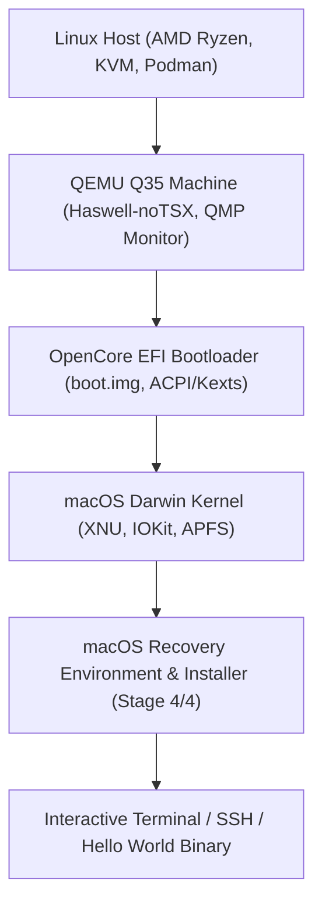
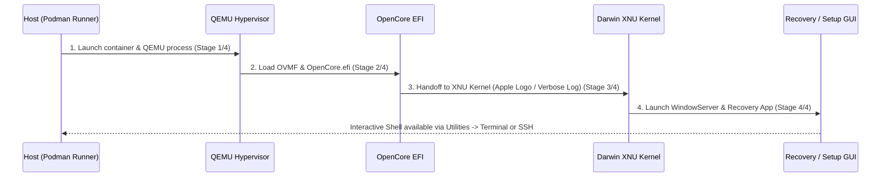

# macOS Containers on AMD KVM & Podman: Architecture, Quirks, and Diagnostic Guide

Case study and empirical reference guide for virtualizing and containerizing macOS (macOS 11 Big Sur through macOS 14 Sonoma) on Linux x86_64 host kernels using KVM, Podman, QEMU, and OpenCore on AMD Ryzen processors.

---

## 1. Overview & Virtualization Architecture

Virtualizing macOS within standard rootless/rootful Linux containers (`dockur/macos` or custom QEMU/KVM wrappers) involves orchestrating four distinct layers:



### Key Hardware Boundaries & Ports
* **Web UI (noVNC)**: `http://localhost:8006` (VNC over WebSockets with custom cursor styling)
* **Native VNC**: `localhost:5900`
* **SSH Forwarding**: `ssh -p 2222 localhost` (Guest port 22 mapped to host port 2222)
* **QMP Monitor**: `/dev/shm/monitor.sock` (UNIX domain socket inside container for CPU/register/memory inspection)
* **VirtFS / Shared Dir**: Host repo mounted at `/shared` inside the guest

---

## 2. Empirical Quirks on AMD Ryzen & Fix Matrix

Virtualizing macOS on AMD Ryzen introduces specific x86 virtualization and kernel quirks that do not occur on Intel VT-x hosts:

| Subsystem / Quirk | Symptom in macOS Guest | Root Cause | Fix / Mitigation |
| :--- | :--- | :--- | :--- |
| **64-bit PCI MMIO Hole** | `PHYSMAP_PTOV bounds exceeded` panic during memory bootstrap | QEMU default `pci-hole64-size` places PCI MMIO space above XNU's direct physical map limit | Pass `-global q35-pcihost.pci-hole64-size=0` in QEMU `ARGS` |
| **Intel CPUID Spoofing** | Immediate boot hang / kernel panic on CPU topology probe | XNU expects GenuineIntel MSRs, TSC invariants, and specific instruction subsets | Pass `-cpu Haswell-noTSX,vendor=GenuineIntel,+invtsc,vmware-cpuid-freq=on` |
| **Haswell Pre-C0 Stepping** | `"Haswell pre-C0 steppings are not supported"` at `machine_check.c:96` | QEMU's default Haswell stepping is `stepping=1` (pre-C0), rejected by XNU | Set `stepping=3` or `stepping=4` on QEMU CPU model |
| **Early PRNG Trap (SurPlus)** | Kernel trap at early boot (`_early_random` / PRNG init) | Big Sur 11.3+ introduced strict RDRAND/RDSEED expectations in `read_erandom` | Enable OpenCore SurPlus patches (`read_erandom` & `register_and_init_prng`) |
| **IOMapper / AppleVTD** | Page fault at `0x40` / NULL dereference in `IOPMrootDomain` | AppleVTD tries to initialize non-existent Intel VT-d DMAR tables on AMD KVM | Enable `DisableIoMapper: true` in OpenCore `Kernel->Quirks` |
| **Early Serial Diagnostics** | Silent halts with no serial log output | OpenCore release kernel suppresses early panic dumps to UART0 | Enable `Patch 5` (panic string to serial), `Patch 6` (early prints), and add `serial=3 debug=0x100` |
| **EFI NVRAM Target Crash** | QEMU hangs when OpenCore writes NVRAM log to read-only disk | OpenCore attempts filesystem write to read-only virtual floppy/EFI disk | Set `Target: 0` under OpenCore `Misc->Debug` |
| **Screen Auto-Cropping** | Huge solid black borders on screenshot dumps | QEMU framebuffers allocate 1920x1080/1280x720 while guest renders centered native viewport | Apply pure-Go luminance bounding box detection with 16px padding |

---

## 3. The 4-Stage Boot Progression Model

Monitoring the boot sequence is categorized into four observable phases:



1. **Stage 1/4 (Hypervisor Init)**: Podman starts container, QEMU maps memory and attaches tap networking and storage disks.
2. **Stage 2/4 (Bootloader Init)**: OVMF firmware loads `OpenCore.efi`, parses `config.plist`, applies kernel patches, and presents boot picker or direct boots `macOS Base System`.
3. **Stage 3/4 (Kernel Active)**: OpenCore jumps to `boot.efi` and transfers execution to the Darwin XNU kernel (`HANDOFF TO XNU`). Verbose logs stream to serial and screen.
4. **Stage 4/4 (Interactive System)**: `launchd` initializes `WindowServer`, loads macOS Recovery GUI, and opens SSH daemon on port 22.

---

## 4. Diagnostic & Deep Inspection Toolkit

Our CLI runner (`scripts/macos-podman/main.go`) provides built-in deep inspection tools via QMP monitor socket:

* **Boot Status**: `go run ./scripts/macos-podman boot-status [-s]`
  * Queries HTTP, VNC, SSH, QEMU CPU thread state, serial logs, and captures auto-cropped guest screenshots.
* **Deep Register & Stack Inspection**: `go run ./scripts/macos-podman inspect`
  * Reads RIP, RSP, CR0, CR2 (Page Fault Address), CR3 (Page Table Base), and CPL (Ring 0 supervisor vs Ring 3 user).
  * Disassembles active machine instructions at `$rip`.
  * Dumps stack slots at `$rsp` and traverses trap call frames to pinpoint faulting C++/Mach functions in XNU.

---

## 5. Execution of Go Darwin Binaries in Recovery GUI

Once Stage 4/4 is active:
1. Open the Web UI at `http://localhost:8006` (or VNC `localhost:5900`).
2. Select your preferred language (e.g. English) in the **Language Chooser** dialog and click the arrow.
3. In the top macOS menu bar, open **Utilities &rarr; Terminal**.
4. The host repository is mounted via VirtFS 9p at `/shared` (or accessible via network/storage).
5. Execute cross-compiled Darwin binaries directly:
   ```bash
   /shared/scripts/macos-hello/hello_darwin_amd64
   ```

